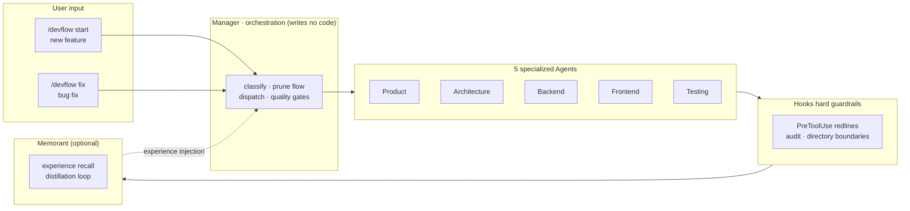

# DevFlow

**Version: 1.0.0**

English | [中文](README.zh-CN.md)

DevFlow analyzes the repository during `init` instead of assuming every project is a backend/frontend application. It classifies projects into seven categories — `traditional_application`, `ai_agent_application`, `agent_plugin`, `skill`, `mcp_server`, `ai_tool_or_workflow`, and `library_or_other` — from explainable repository evidence, then selects only the compatible lifecycle tracks. Traditional applications keep the backend/frontend flow (with optional `integration`/`testing`); AI projects use tracks such as plugin, command, skill, agent, prompt, hook, MCP/tool, evaluation, packaging, and documentation as applicable. `backend` and `frontend` are ordinary optional tracks, present only when the repository evidence shows them.

Codex is supported through `adapters/codex/`. Its current redline capability is **soft**: official Codex extension points for Skills, MCP hooks, and command approvals are supported, but a generic Claude-style pre-tool file-write deny hook has not been verified. Claude Code retains hard PreToolUse protection.


DevFlow connects product discovery, architecture, backend/frontend implementation, testing, acceptance, and reusable engineering memory through one workflow. Humans make decisions at explicit gates; the Manager coordinates the remaining work with artifact contracts and safety guardrails.

> **Current status:** Claude Code and Codex CLI are supported adapters. Claude Code provides hard PreToolUse protection. Codex provides a protocol-complete adapter with soft redline protection because a generic pre-tool file-write deny hook has not been verified; validate live app-server integration in your environment before relying on unattended execution.

## Quick Install (Fresh Machine)

### Prerequisites

- **Claude Code** with plugin support
- **Python 3.8+** (pre-installed on macOS; `brew install python` if missing)
- **Git**

### One-Command Install

```bash
# Clone this repository (or copy the devflow/ directory anywhere)
git clone git@github.com:starme/devflow.git ~/devflow

# Run the installer (makes hooks executable, copies global rules)
cd ~/devflow && bash install.sh
```

Then in Claude Code, run:

```
/plugin marketplace add ~/devflow
/plugin install devflow@devflow-marketplace
```

Restart Claude Code. The plugin loads automatically.

### Install Codex CLI

Codex is a separate host runtime. Install it using one of the official methods:

```bash
# npm
npm install -g @openai/codex

# or Homebrew on macOS
brew install --cask codex
```

### Install DevFlow from the Codex Plugin Marketplace

The recommended path is Codex Plugin Marketplace installation; manual Skill copying is only a fallback:

```bash
# From a local DevFlow checkout
codex plugin marketplace add .
codex plugin list --marketplace devflow-marketplace
codex plugin add devflow@devflow-marketplace
```

From GitHub, use the repository marketplace directly:

```bash
codex plugin marketplace add starme/devflow --ref main
codex plugin list --marketplace devflow-marketplace
codex plugin add devflow@devflow-marketplace
```

Open a new Codex thread after installation, then in the target project run:

```text
$devflow init
$devflow status
```

The package manifest is in [`plugins/devflow/.codex-plugin/plugin.json`](plugins/devflow/.codex-plugin/plugin.json), and the repository marketplace is in [`.agents/plugins/marketplace.json`](.agents/plugins/marketplace.json). See [`plugins/devflow/install.md`](plugins/devflow/install.md) for fallback and app-server details.


1. Verifies Python 3 is available
2. Makes all hook scripts executable (`.sh` and `.py`)
3. Copies the universal engineering rule to `~/.claude/rules/engineering.md` (if not present)
4. Checks whether Memorant is installed (optional)

Language/framework rules stay in the plugin directory and are loaded by agents at runtime — this lets plugin upgrades update rules automatically.

### Optional: Install Memorant

DevFlow works without Memorant, but experience recall and distillation require it. Install and configure the [Memorant plugin](https://github.com/starme/memorant) separately. Without Memorant, DevFlow still runs the full lifecycle — it just skips memory recall and writes a plain markdown retrospective at project end.

## Updating DevFlow

DevFlow does not silently upgrade itself. Refresh the configured Codex Marketplace and compare the installed and available versions:

```bash
codex plugin marketplace upgrade devflow-marketplace
codex plugin list --marketplace devflow-marketplace
```

If a newer version is available, reinstall the plugin:

```bash
codex plugin add devflow@devflow-marketplace
```

Start a new Codex thread after upgrading so the new Skill is discovered. Do not upgrade while an active DevFlow task is running unless you have reviewed the release changes. If your Codex version exposes a different update command, consult `codex plugin --help`.

## Project analysis and adaptive tracks

During `/devflow init`, DevFlow scans safe repository evidence and writes the detected category, confidence, evidence, capabilities, and selected tracks to `.devflow/project.yaml` — the project-level, long-lived configuration. It contains no per-requirement state: current phase, task description, branches, or PRD live in a per-task `.devflow/task.yaml` (see [Workflow](#workflow)). The seven supported categories are listed in the intro above. Low-confidence or conflicting evidence is surfaced for confirmation.

Per-requirement track selection happens later, at `/devflow start`, when the architecture Agent chooses `workflow.selected_tracks` for that task's `scope.yaml`. Traditional applications retain backend/frontend/API tracks. AI-oriented projects receive only applicable tracks such as plugin, command, skill, agent, prompt, hook, MCP/tool, integration, evaluation, packaging, and documentation. The built-in cross-category tracks — `product`, `architecture`, and `distill` — always apply; `backend` and `frontend` are optional and only appear with supporting evidence. This prevents empty backend/frontend work from being dispatched for a plugin or Skill repository.

## Codex adapter

The Codex adapter is located at [`adapters/codex/`](adapters/codex/). It provides command mapping, Codex Skill and `AGENTS.md` instructions, app-server `turn/start` payload guidance, MCP/approval integration guidance, runtime context bridging, core audit logging, installation instructions, and protocol-level tests.

Codex capability is intentionally **soft**. Official Codex documentation confirms Skill inputs, MCP tools/hooks, and `item/commandExecution/requestApproval`, but does not currently verify a generic synchronous file-write deny hook equivalent to Claude Code `PreToolUse`. The adapter therefore uses Codex approvals, instruction-level redlines, and post-action audit logging; it must not claim hard file-write interception.


| Command | Purpose |
|---------|---------|
| `/devflow init` | Initialize project: detect stack, configure paths, generate project configuration, rules, and redlines |
| `/devflow start <需求描述>` | Start a new feature: full lifecycle from PRD to acceptance |
| `/devflow fix <bug 描述>` | Bug fix mode: root cause diagnosis → fix → regression test → memory capture |
| `/devflow status` | Show current phase, progress, artifacts, next action |
| `/devflow next` | Continue from an interrupted phase |

### Starting a New Project

```bash
# In your project directory:
/devflow init
/devflow start "I want to build a team weekly report tool"
```

This single command:
1. Detects your project category and capabilities (traditional app, AI agent, Agent Plugin, Skill, MCP server, etc.)
2. Selects compatible lifecycle tracks instead of assuming backend/frontend work
3. Generates `.devflow/project.yaml` (project-level configuration)
4. Installs relevant coding rules under `.devflow/rules/`
5. Copies `.devflow/redlines.yaml` (redline protection rules)
6. Starts Socratic product Q&A

> **Note:** `/devflow init` no longer generates `CLAUDE.md`, nor does it write a `manifest.yaml`. It creates `project.yaml` plus `.devflow/rules/` and `.devflow/redlines.yaml`, and prepares the `docs/` (including `docs/adr/`) and `.devflow/contracts` directories. Legacy projects that already have a `.devflow/manifest.yaml` keep working through a read-only compatibility path — see [Project state model](#project-state-model).

### Fixing Bugs / Daily Maintenance

Most daily work isn't new projects — it's fixing bugs, small changes, and refactors. Use `/devflow fix`:

```bash
/devflow fix "登录页点击提交后报 500 错误"
```

This runs a lightweight loop: **symptom → root cause → fix → regression test → structured memory capture**. No PRD, no architectural review, no acceptance ceremony, no project-wide manifest. Each `/devflow fix` (like each `/devflow start`) creates its own isolated task worktree with a per-task `.devflow/task.yaml`; the loop skips `manifest.yaml` only in the sense that no project-level `manifest.yaml` is required for it to run.

#### How Memorant Covers Bug Fixing

Memorant's hooks provide **always-on passive collection** that works regardless of whether you use DevFlow commands:

- **PostToolUseFailure**: any tool error is captured with full evidence, and similar past errors are recalled immediately
- **UserPromptSubmit**: your bug description triggers recall of related memories
- **PostToolUse (Bash)**: test failures/successes and git commits are logged as structured events
- **PreCompact / Stop**: pending events are distilled into memories

DevFlow's `/devflow fix` adds one thing passive hooks can't: after the fix is verified, it writes a **structured root-cause + resolution narrative** (symptom, root cause, fix approach, affected files, regression test). This is higher quality than letting distillation infer it from disjoint events.

## Workflow

DevFlow is not a single monolithic agent. It is a **plugin** — commands, hooks, an orchestration Skill, and sub-agents — with this shape:



The full state machine — with the phase-by-phase `CLASSIFY → PRODUCT_QA → PRD_WRITING → GATE_PRD → ARCHITECTURE → GATE_ARCH → DEVELOPMENT → TESTING → ACCEPTANCE → DISTILL → DONE` sequence, the inner/outer loop boundaries, and the bugfix/chore pruning paths — lives in [docs/workflow.md](docs/workflow.md).

### Human Checkpoints

You only need to be involved at 4 points:
1. **Product Q&A** — clarify what to build
2. **PRD Review** — approve product requirements
3. **Architecture Review** — approve tech design
4. **Acceptance Sign-off** — final approval

Everything else runs automatically, including test-fix loops (up to 3 retries before pausing).

Automatic phases use the Stop hook to ask the Manager to continue in the same session. If the host ends the session anyway, run `/devflow next`; Gate phases always wait for human approval.

## Project state model

DevFlow separates project-level facts from per-requirement runtime state using layered state files:

| File | Purpose | Scope |
|------|---------|-------|
| `.devflow/project.yaml` | Long-lived project configuration: category, capabilities, workspace, adapter, redlines/rules paths, Memorant key | One per repository; contains **no** current phase, task description, branch, or PRD |
| `.devflow/task.yaml` | Per-requirement persistent state: task id/kind/description, `git.base_ref`/`git.base_commit`, branch/worktree, selected tracks, current phase, artifact references | One per task worktree |
| `.devflow/scope.yaml` | Requirement architecture contract (scope, boundaries, dispatch, artifact contracts) | Generated by the architecture Agent for the current task; not copied to other tasks |
| `.devflow/context.json` | Runtime context (task_id, run_id, phase, agent, cwd, worktree, branch, adapter) | Transient per task worktree |
| `.devflow/manifest.yaml` | Legacy, read-only compatibility | Only for pre-existing projects; new tasks prefer `project.yaml` + task worktrees |

Every `/devflow start` and `/devflow fix` creates an isolated git worktree (outside the repo, under `../.devflow-worktrees/<repo>/<task-id>/`) and writes its own `.devflow/task.yaml` there. Different requirements never share a worktree. For legacy `manifest.yaml` projects, `core/orchestrator/migration.py` performs an idempotent migration that derives `project.yaml` and a read-only `tasks/legacy/task.yaml` — the old manifest is neither deleted nor overwritten.

## Redline Protection

DevFlow enforces file safety through PreToolUse hooks — not just agent prompts. Three protection levels:

| Level | Behavior | Examples |
|-------|----------|---------|
| 🔴 **Forbidden** | Read and write are blocked | `.env`, `*.pem`, `*.key`, `secrets.*`, cloud credentials |
| 🟡 **Protected** | Reads are allowed; modifications are blocked | CI/CD configs, `Dockerfile`, lockfiles, `.git/**` |
| 🟠 **Approval required** | Modification asks for human approval | `package.json`, `go.mod`, migrations, auth code |

Additional guardrails:
- **Directory boundaries**: backend agent cannot write to frontend directory and vice versa
- **Test file protection**: dev agents cannot edit existing tests during development phase
- **Dangerous Bash blocking**: `rm -rf /`, force push, `curl | sh`, etc.
- **Audit log**: every Write/Edit/Bash is logged to `.devflow/runs/<run_id>/audit.log`

Rules live in `.devflow/redlines.yaml` (generated by `/devflow init` from the template). Users can edit this file to add project-specific protections — changes take effect immediately.

## Architecture: Platform-Agnostic Core + Thin Adapters

DevFlow is **not** hard-wired to Claude Code. It is split into a platform-agnostic `core/` and a thin adapter per host platform:

- **`core/`** — the engine, shared by every adapter. Contains the workflow state machine, redline/audit hook scripts (pure Python, stdlib only), coding rules, and project templates. It has **zero** Claude-specific imports.
- **Claude Code adapter** — lives at the plugin root (`.claude-plugin/`, `commands/`, `hooks/devflow-hook.*`, `agents/`). It glues Claude Code's extension points (slash commands, PreToolUse/PostToolUse hooks, Task-tool subagents) to `core/`.
- **`adapters/`** — holds the [adapter contract](adapters/README.md) and the platform adapters. The Codex adapter already exists at [`adapters/codex/`](adapters/codex/) (soft redline capability); Cursor and Trae adapters are future work.

The hook scripts self-locate `core/` via `__file__` and also honor `CLAUDE_PLUGIN_ROOT`, so the same scripts run unchanged under any platform that can pipe JSON to them. See [adapters/README.md](adapters/README.md) for the porting contract and hard/soft capability tiers.

## What's Bundled

```
devflow/
├── .claude-plugin/             # [Claude adapter] plugin manifest
│   ├── marketplace.json
│   └── plugin.json             #   registers commands + core/ hooks
├── core/                       # ===== PLATFORM-AGNOSTIC CORE =====
│   ├── project_analyzer.py     #   evidence-based classification + track selection
│   ├── orchestrator/           #   workflow engine: state machine + dispatch
│   │   ├── SKILL.md            #     Manager orchestration rules
│   │   ├── migration.py        #     legacy manifest → project/task migration
│   │   ├── task_state.py       #     task.yaml schema + fields
│   │   ├── worktree_manager.py #     per-task git worktree lifecycle
│   │   └── worktree_sync.py    #     collect .devflow/ artifacts from worktrees
│   ├── hooks/                  #   pure-Python CLI scripts (no Claude deps)
│   │   ├── devflow_guard_common.py
│   │   ├── redline-guard.py    #     PreToolUse hard guard (stdin JSON → decision)
│   │   └── audit-log.py        #     PostToolUse audit logger
│   ├── rules/                  #   built-in coding rules (loaded at runtime)
│   │   ├── engineering.md
│   │   ├── backend/{go,php,python}/
│   │   └── frontend/vue/
│   ├── templates/              #   project/state templates
│   │   ├── project.yaml        #     project-level configuration
│   │   ├── task.yaml           #     per-task worktree state
│   │   ├── scope.yaml          #     architecture contract template
│   │   ├── context.json        #     runtime context template
│   │   ├── redlines.yaml       #     three-tier redline rules
│   │   └── rules-{project,backend,frontend}.md
│   └── tests/                  #   pure-Python unit tests
├── commands/                   # [Claude adapter] slash commands
│   ├── devflow.md              #   /devflow (root dispatcher)
│   ├── init.md                 #   /devflow init
│   ├── start.md                #   /devflow start
│   ├── fix.md                  #   /devflow fix
│   ├── status.md               #   /devflow status
│   └── next.md                 #   /devflow next
├── agents/                     # [Claude adapter] 5 subagents (role bodies are portable)
│   ├── product-agent.md
│   ├── architect-agent.md
│   ├── backend-dev-agent.md
│   ├── frontend-dev-agent.md
│   └── tester-agent.md
├── hooks/                      # [Claude adapter] lifecycle hook (SessionStart/Stop/...)
│   ├── devflow-hook.sh
│   └── devflow_hook.py
├── adapters/                   # platform adapter contract + adapters
│   ├── README.md               #   adapter contract + capability tiers (hard/soft)
│   └── codex/                  #   Codex adapter (skill, AGENTS.md, context bridge, tests)
├── plugins/devflow/            # package manifest + install docs
│   ├── .codex-plugin/plugin.json
│   └── install.md
├── .agents/plugins/
│   └── marketplace.json        # repository Marketplace
├── install.sh
├── README.md
└── README.zh-CN.md
```

## How Rules Loading Works

DevFlow uses Claude Code's native path-based rule loading:

1. `install.sh` copies universal rules to `~/.claude/rules/`
2. `/devflow init` copies language-specific and framework-specific rules
3. When you edit a `.go` file, Go rules auto-load; when you edit `.vue`, Vue rules auto-load
4. The orchestrator does NOT manage rule injection — Claude Code handles it natively

This means rules work even outside DevFlow commands — they're always active when you code.

## Dependencies

| Dependency | Required | Purpose |
|-----------|----------|---------|
| Claude Code | ✅ | Runtime |
| Python 3.8+ | ✅ | Hook scripts (stdlib only, no pip) |
| Memorant plugin | ❌ Optional | Experience recall & distillation |
| gitnexus | ❌ Optional | Codebase indexing |

## Uninstall

```bash
# Remove symlink
rm -rf ~/.claude/plugins/marketplaces/devflow-marketplace

# Optionally remove rules (only if you don't use them elsewhere)
# rm -rf ~/.claude/rules/backend ~/.claude/rules/frontend/vue
# rm -f ~/.claude/rules/engineering.md
```
