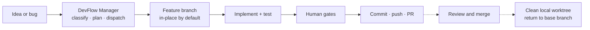

# DevFlow

**Version: 1.0.1**

English | [中文](README.zh-CN.md)

DevFlow is a lifecycle orchestrator for AI-assisted software development. It turns a request into a structured path through planning, architecture, implementation, testing, human review, and pull-request delivery.

It adapts to the repository instead of assuming every project is a backend/frontend application, and coordinates specialized agents on a feature branch — isolating a latercomer only when the main workspace is already busy.



## Why DevFlow?

- **Adaptive workflow** — detects the repository type and enables only relevant work.
- **Coordinated roles** — a Manager routes work between product, architecture, implementation, and testing agents.
- **Safe isolation** — the current demand uses a feature branch in the main workspace; a second unfinished task gets a worktree so the first one is not moved.
- **Human checkpoints** — people approve important decisions; routine work continues automatically.
- **Delivery-ready output** — acceptance leads to an explicit commit, push, and PR flow without automatic merging.

## Quick Start

### Install for Claude Code

```text
/plugin marketplace add starme/devflow
/plugin install devflow@devflow-marketplace
```

Use `starme/devflow#main` to pin the marketplace to a branch, then restart Claude Code.

### Install for Codex CLI

```bash
npm install -g @openai/codex
```

```bash
codex plugin marketplace add starme/devflow --ref main
codex plugin add devflow@devflow-marketplace
```

Open a new Codex thread after installation.

### Start a task

In the project you want to work on:

```text
/devflow init
/devflow start "Build a team weekly report tool"
```

For a bug or maintenance change:

```text
/devflow fix "Login submission returns HTTP 500"
```

Use `/devflow status` to inspect progress. Automatic phases continue to the next Gate without `/devflow next`. Use `/devflow next --task <task-id>` to resume after an interrupted session or to clean up after a merged PR.

## How it works

1. **Classify** — DevFlow identifies the repository type and chooses a suitable workflow.
2. **Clarify and plan** — product and architecture work produces a PRD, scope, and implementation plan when needed.
3. **Branch and implement** — the first unfinished task stays in the main workspace on a feature branch; a latercomer that would collide gets a worktree. Agents stay inside defined boundaries.
4. **Test and review** — tests run in layers and failures are routed back for correction.
5. **Accept** — a human reviews the result against the agreed requirements.
6. **Deliver** — one confirmation covers the allow-listed commit, branch push, and PR creation.

The detailed state machine and shortened paths for bugfix/chore tasks are in [docs/workflow.md](docs/workflow.md).

### Human checkpoints

You only need to make decisions at five points:

1. Product Q&A — clarify what to build.
2. PRD review — approve product requirements.
3. Architecture review — approve the technical approach and scope.
4. Acceptance sign-off — approve the result.
5. Delivery confirmation — approve `commit + push + create PR`.

## After acceptance

After you approve the result, DevFlow shows the allow-listed files, commit message, push target, and PR preview in one confirmation. A plain approval executes `commit + push + create PR`; other instructions can narrow or adjust those actions.

- Only code and explicitly listed task artifacts are committed; runtime context, audit logs, and temporary files are excluded.
- On delivery, task artifacts are archived to `.devflow/tasks/<task-id>/` (the PRD is published as `prd-<task-slug>.md`, other artifacts keep fixed names) so you can trace what was planned, completed, tested, and accepted. See [the archive decision](docs/adr/0004-task-archive-convergence.md).
- PR creation pauses the task. DevFlow never merges the PR automatically.
- After the PR is merged, run `/devflow next --task <task-id>` to remove the local task worktree and local branch, keep the remote branch, and return to the task's base branch.
- See [the delivery decision](docs/adr/0002-delivery-lifecycle.md) for recovery details.

## Commands

| Command | Purpose |
|---------|---------|
| `/devflow init` | Detect the project and create project-level configuration. |
| `/devflow start <description>` | Start a feature task with the full lifecycle. |
| `/devflow fix <description>` | Start a bugfix or maintenance task with a shorter lifecycle. |
| `/devflow status` | Show project and task status. |
| `/devflow next --task <task-id>` | Resume the selected task or finish its delivery cleanup. |

## Supported hosts

- **Claude Code** — full adapter with hard PreToolUse file-safety protection.
- **Codex CLI** — supported adapter with soft redline protection; verify host integration before unattended execution.

See the [adapter contract](adapters/README.md) for capability boundaries and platform details.

## Security summary

DevFlow applies three safety levels:

- **Forbidden** — reads and writes are blocked for secrets and credential files.
- **Protected** — reads are allowed, but modifications require protection handling.
- **Approval required** — sensitive configuration, dependency, migration, or authentication changes require human approval.

It also enforces task directory boundaries, protects existing tests during implementation, blocks dangerous commands, and records tool activity for audit. See the project redline configuration and [architecture notes](docs/architecture.md) for details.

## Memorant (optional)

Memorant adds experience recall, bug patterns, product decisions, and distillation. DevFlow works without it; when unavailable, the lifecycle continues without memory recall.

Install Memorant separately from the [Memorant project](https://github.com/starme/memorant).

## Documentation

- [Detailed workflow](docs/workflow.md)
- [Architecture notes](docs/architecture.md)
- [Delivery lifecycle decision](docs/adr/0002-delivery-lifecycle.md)
- [Task artifact publishing decision](docs/adr/0003-task-artifact-publishing.md)
- [Adapter contract](adapters/README.md)

## Updating and uninstalling

Update the marketplace and reinstall the plugin using the host's normal plugin commands. Do not upgrade while an active task is running unless you have reviewed the release changes.

To uninstall the Claude Code marketplace installation, remove the installed marketplace through Claude Code's plugin management. Project task branches and worktrees should be cleaned through `/devflow next --task <task-id>` after their PRs are merged.
