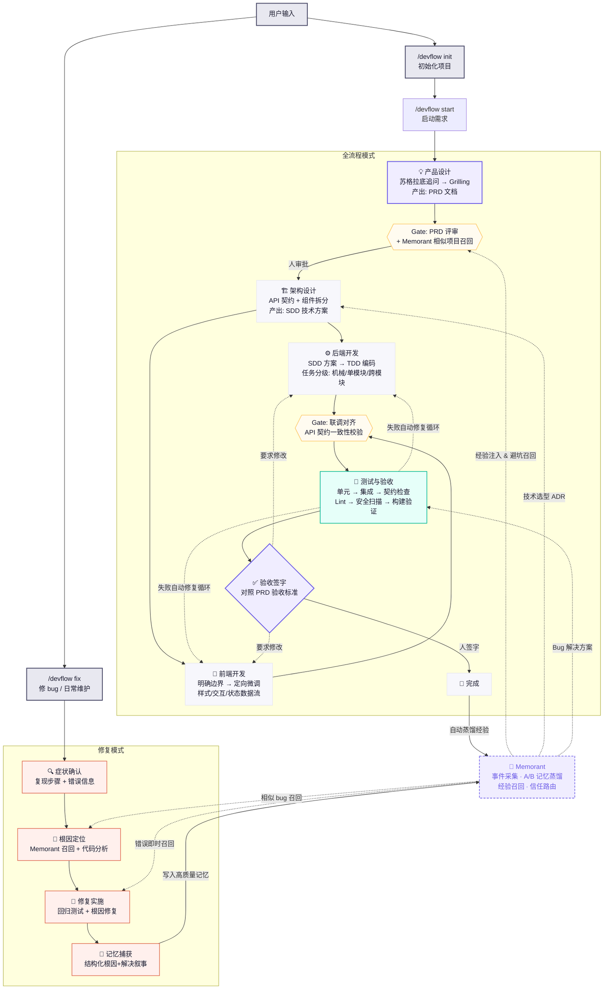

# DevFlow

English | [中文](README.zh-CN.md)

AI-assisted application development lifecycle orchestrator for Claude Code.

DevFlow connects product discovery, architecture, backend/frontend implementation, testing, acceptance, and reusable engineering memory through one workflow. Humans make decisions at explicit gates; the Manager coordinates the remaining work with artifact contracts and safety guardrails.

> **Current status:** Claude Code is the only supported adapter. The 0.2.x release is a working lifecycle prototype with verified hook/worktree safeguards; run a real project before relying on unattended end-to-end execution.

## Quick Install (Fresh Machine)

### Prerequisites

- **Claude Code** with plugin support
- **Python 3.8+** (pre-installed on macOS; `brew install python` if missing)
- **Git**

### One-Command Install

```bash
# Clone this repository (or copy the devflow/ directory anywhere)
git clone git@github.com:starme/devflow.git ~/devflow

# Run the installer (makes hooks executable, copies global rules)
cd ~/devflow && bash install.sh
```

Then in Claude Code, run:

```
/plugin marketplace add ~/devflow
/plugin install devflow@devflow-marketplace
```

Restart Claude Code. The plugin loads automatically.

### What the Installer Does

1. Verifies Python 3 is available
2. Makes all hook scripts executable (`.sh` and `.py`)
3. Copies the universal engineering rule to `~/.claude/rules/engineering.md` (if not present)
4. Checks whether Memorant is installed (optional)

Language/framework rules stay in the plugin directory and are loaded by agents at runtime — this lets plugin upgrades update rules automatically.

### Optional: Install Memorant

DevFlow works without Memorant, but experience recall and distillation require it. Without Memorant, DevFlow still runs the full lifecycle — it just skips memory recall and writes a plain markdown retrospective at project end instead.

## Usage

| Command | Purpose |
|---------|---------|
| `/devflow init` | Initialize project: detect stack, configure paths, generate rules/manifest/redlines |
| `/devflow start <需求描述>` | Start a new feature: full lifecycle from PRD to acceptance |
| `/devflow fix <bug 描述>` | Bug fix mode: root cause diagnosis → fix → regression test → memory capture |
| `/devflow status` | Show current phase, progress, artifacts, next action |
| `/devflow next` | Continue from an interrupted phase |

### Starting a New Project

```bash
# In your project directory:
/devflow init
/devflow start "I want to build a team weekly report tool"
```

This single command:
1. Detects your tech stack (go-zero? Laravel? Vue?)
2. Generates CLAUDE.md
3. Installs all relevant coding rules
4. Creates `.devflow/manifest.yaml`
5. Starts Socratic product Q&A

### Fixing Bugs / Daily Maintenance

Most daily work isn't new projects — it's fixing bugs, small changes, and refactors. Use `/devflow fix`:

```bash
/devflow fix "登录页点击提交后报 500 错误"
```

This runs a lightweight loop: **symptom → root cause → fix → regression test → structured memory capture**. No manifest, no phases, no overhead.

#### How Memorant Covers Bug Fixing

Memorant's hooks provide **always-on passive collection** that works regardless of whether you use DevFlow commands:

- **PostToolUseFailure**: any tool error is captured with full evidence, and similar past errors are recalled immediately
- **UserPromptSubmit**: your bug description triggers recall of related memories
- **PostToolUse (Bash)**: test failures/successes and git commits are logged as structured events
- **PreCompact / Stop**: pending events are distilled into memories

DevFlow's `/devflow fix` adds one thing passive hooks can't: after the fix is verified, it writes a **structured root-cause + resolution narrative** (symptom, root cause, fix approach, affected files, regression test). This is higher quality than letting distillation infer it from disjoint events.

## Workflow



**图例：** 紫色边框 = 需要人决策 ｜ 黄色虚线框 = 质量门禁 ｜ 绿色 = 测试阶段 ｜ 橙色 = 修复模式 ｜ 紫色虚线 = Memorant 学习闭环

### Human Checkpoints

You only need to be involved at 4 points:
1. **Product Q&A** — clarify what to build
2. **PRD Review** — approve product requirements
3. **Architecture Review** — approve tech design
4. **Acceptance Sign-off** — final approval

Everything else runs automatically, including test-fix loops (up to 3 retries before pausing).

Automatic phases use the Stop hook to ask the Manager to continue in the same session. If the host ends the session anyway, run `/devflow next`; Gate phases always wait for human approval.

## Redline Protection

DevFlow enforces file safety through PreToolUse hooks — not just agent prompts. Three protection levels:

| Level | Behavior | Examples |
|-------|----------|---------|
| 🔴 **Forbidden** | Read and write are blocked | `.env`, `*.pem`, `*.key`, `secrets.*`, cloud credentials |
| 🟡 **Protected** | Reads are allowed; modifications are blocked | CI/CD configs, `Dockerfile`, lockfiles, `.git/**` |
| 🟠 **Approval required** | Modification asks for human approval | `package.json`, `go.mod`, migrations, auth code |

Additional guardrails:
- **Directory boundaries**: backend agent cannot write to frontend directory and vice versa
- **Test file protection**: dev agents cannot edit existing tests during development phase
- **Dangerous Bash blocking**: `rm -rf /`, force push, `curl | sh`, etc.
- **Audit log**: every Write/Edit/Bash is logged to `.devflow/runs/<run_id>/audit.log`

Rules live in `.devflow/redlines.yaml` (generated by `/devflow init` from the template). Users can edit this file to add project-specific protections — changes take effect immediately.

## Architecture: Platform-Agnostic Core + Thin Adapters

DevFlow is **not** hard-wired to Claude Code. It is split into a platform-agnostic `core/` and a thin adapter per host platform:

- **`core/`** — the engine, shared by every adapter. Contains the workflow state machine, redline/audit hook scripts (pure Python, stdlib only), coding rules, and project templates. It has **zero** Claude-specific imports.
- **Claude Code adapter** — lives at the plugin root (`.claude-plugin/`, `commands/`, `hooks/devflow-hook.*`, `agents/`). It glues Claude Code's extension points (slash commands, PreToolUse/PostToolUse hooks, Task-tool subagents) to `core/`.
- **`adapters/`** — holds the [adapter contract](adapters/README.md) and, in the future, Codex / Cursor / Trae adapters.

The hook scripts self-locate `core/` via `__file__` and also honor `CLAUDE_PLUGIN_ROOT`, so the same scripts run unchanged under any platform that can pipe JSON to them. See [adapters/README.md](adapters/README.md) for the porting contract and hard/soft capability tiers, and [docs/delivery-report.md](docs/delivery-report.md) for the consolidated cross-platform architecture, adapter status, and verification report.

## What's Bundled

```
devflow/
├── .claude-plugin/             # [Claude adapter] plugin manifest
│   ├── marketplace.json
│   └── plugin.json             #   registers commands + core/ hooks
├── core/                       # ===== PLATFORM-AGNOSTIC CORE =====
│   ├── orchestrator/SKILL.md   #   workflow engine: state machine + dispatch
│   ├── hooks/                  #   pure-Python CLI scripts (no Claude deps)
│   │   ├── devflow_guard_common.py
│   │   ├── redline-guard.py    #     PreToolUse hard guard (stdin JSON → decision)
│   │   └── audit-log.py        #     PostToolUse audit logger
│   ├── rules/                  #   built-in coding rules (loaded at runtime)
│   │   ├── engineering.md
│   │   ├── backend/{go,php,python}/
│   │   └── frontend/vue/
│   └── templates/              #   project templates
│       ├── manifest.yaml
│       ├── redlines.yaml       #     three-tier redline rules
│       ├── scope.yaml
│       └── rules-{project,backend,frontend}.md
├── commands/                   # [Claude adapter] slash commands
│   ├── devflow.md              #   /devflow (root dispatcher)
│   ├── init.md                 #   /devflow init
│   ├── start.md                #   /devflow start
│   ├── fix.md                  #   /devflow fix
│   ├── status.md               #   /devflow status
│   └── next.md                 #   /devflow next
├── agents/                     # [Claude adapter] 5 subagents (role bodies are portable)
│   ├── product-agent.md
│   ├── architect-agent.md
│   ├── backend-dev-agent.md
│   ├── frontend-dev-agent.md
│   └── tester-agent.md
├── hooks/                      # [Claude adapter] lifecycle hook (SessionStart/Stop/...)
│   ├── devflow-hook.sh
│   └── devflow_hook.py
├── adapters/
│   └── README.md               # adapter contract + capability tiers (hard/soft)
├── docs/
│   ├── architecture.md         # cross-platform technical design
│   └── delivery-report.md      # consolidated delivery report (architecture + contract + status)
├── install.sh
└── README.md
```

## How Rules Loading Works

DevFlow uses Claude Code's native path-based rule loading:

1. `install.sh` copies universal rules to `~/.claude/rules/`
2. `/devflow init` copies language-specific and framework-specific rules
3. When you edit a `.go` file, Go rules auto-load; when you edit `.vue`, Vue rules auto-load
4. The orchestrator does NOT manage rule injection — Claude Code handles it natively

This means rules work even outside DevFlow commands — they're always active when you code.

## Dependencies

| Dependency | Required | Purpose |
|-----------|----------|---------|
| Claude Code | ✅ | Runtime |
| Python 3.8+ | ✅ | Hook scripts (stdlib only, no pip) |
| Memorant plugin | ❌ Optional | Experience recall & distillation |
| gitnexus | ❌ Optional | Codebase indexing |

## Uninstall

```bash
# Remove symlink
rm -rf ~/.claude/plugins/marketplaces/devflow-marketplace

# Optionally remove rules (only if you don't use them elsewhere)
# rm -rf ~/.claude/rules/backend ~/.claude/rules/frontend/vue
# rm -f ~/.claude/rules/engineering.md
```
