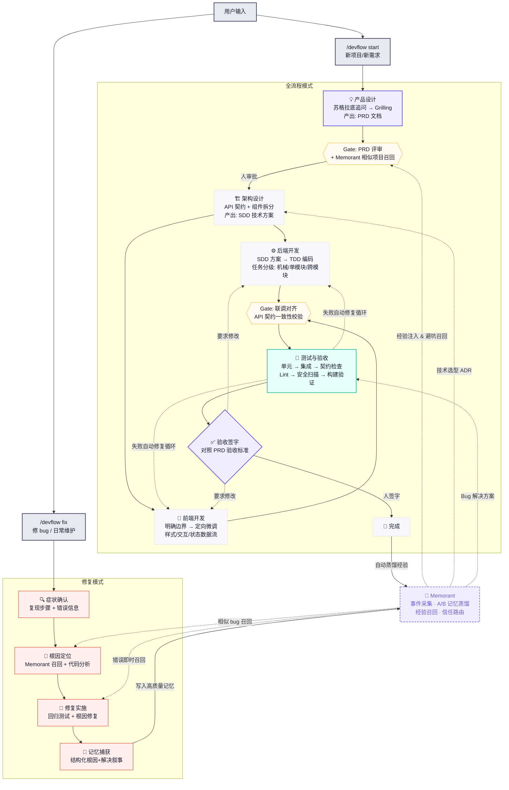

# DevFlow

[English](README.md) | 中文

DevFlow 会在 `init` 阶段分析仓库证据，而不是假设所有项目都是前后端应用。它会识别传统应用、AI Agent 应用、Agent Plugin、Skill、MCP Server 和其他 AI 工作流，并只选择适用的生命周期轨道。已有应用项目继续使用后端/前端流程；AI 项目则按需使用 plugin、command、skill、agent、hook、tool、evaluation、packaging、documentation 等轨道。

Codex 通过 `adapters/codex/` 获得支持。当前红线能力明确为 **Soft**：官方 Codex 扩展点已确认支持 Skill、MCP Hook 和命令审批，但尚未确认通用的、等价于 Claude `PreToolUse` 的文件写入前置拒绝 Hook。Claude Code 继续保留 Hard 级别的 PreToolUse 防护。


DevFlow 将产品需求、架构设计、前后端开发、测试、验收和工程经验沉淀连接为一条工作流：人在明确的 Gate 节点做决策，Manager 通过产物契约和安全护栏协调其余工作。

> **当前状态：** 已支持 Claude Code 和 Codex CLI 适配。Claude Code 提供 Hard 级别的 PreToolUse 防护；Codex 已提供协议级适配，但由于尚未确认通用的文件写入前置拒绝 Hook，红线能力为 Soft。依赖无人值守执行前，请先在目标环境验证 Codex app-server 的真实集成。

## 核心理念

不是一个大而全的单体 Agent，而是一个 **Plugin（命令 + Hooks + 编排 Skill + 子 Agent）**：

- **Manager** 负责任务分类、流程裁剪、Agent 调度、质量门禁，自己不写代码
- **5 个专职 Agent** 各司其职，通过文件系统传递产物，不直接互相通信
- **Hooks 硬约束**在工具执行前拦截危险操作，不依赖 Agent "自觉"
- **Memorant** 可选集成，实现经验召回和自迭代闭环

## 全新电脑一键安装

### 环境要求

- **Claude Code**（需支持插件）
- **Python 3.8+**（macOS 自带；如缺失执行 `brew install python`）
- **Git**

### 安装步骤

```bash
# 1. 克隆仓库（或将 devflow/ 目录复制到任意位置）
git clone <your-repo-url> ~/devflow

# 2. 运行安装脚本（设置 hook 可执行权限、复制全局规则）
cd ~/devflow && bash install.sh
```

然后在 Claude Code 中执行：

```
/plugin marketplace add ~/devflow
/plugin install devflow@devflow-marketplace
```

**重启 Claude Code**，插件自动加载。

### 安装 Codex CLI

Codex 是独立的宿主运行时，需要单独安装。可以使用官方方式之一：

```bash
# npm
npm install -g @openai/codex

# 或 macOS Homebrew
brew install --cask codex
```

然后将本仓库提供给 Codex，并安装 DevFlow 适配层指令：

```bash
git clone https://github.com/starme/devflow.git ~/devflow
cd ~/devflow
bash install.sh
mkdir -p ~/.codex/skills/devflow
cp adapters/codex/devflow-codex.md ~/.codex/skills/devflow/SKILL.md
```

在目标项目中复制或合并适配层指令，不要覆盖项目已有规则：

```bash
cp ~/devflow/adapters/codex/AGENTS.md ./AGENTS.md
# 如果 ./AGENTS.md 已存在，请手动合并 DevFlow 部分。
```

进入目标项目启动 Codex，然后使用 `$devflow` Skill：

```text
$devflow init
$devflow start "做一个团队周报工具"
```

如果使用 Codex app-server 集成，请发送包含 `$devflow` 文本输入和 Skill 输入项的 `turn/start` 请求，并将 Skill 路径指向 `adapters/codex/devflow-codex.md`。具体 CLI/Skill 和 app-server 方式见 [`adapters/codex/install.md`](adapters/codex/install.md)。


1. 检查 Python 3 是否可用
2. 将所有 hook 脚本（`.sh` 和 `.py`）设为可执行
3. 将通用工程规则复制到 `~/.claude/rules/engineering.md`（如不存在）
4. 检测 Memorant 插件是否已安装（可选）

语言/框架规则保留在插件目录中，由 Agent 在运行时按需加载——插件升级时规则自动更新，无需手动复制。

### 可选：安装 Memorant

没有 Memorant DevFlow 也能完整运行，但经验召回和蒸馏功能需要它。请单独安装并配置 [Memorant 插件](https://github.com/starme/memorant)。未安装 Memorant 时，DevFlow 仍能运行完整生命周期，只是跳过经验召回，并在项目结束时写一份纯 Markdown 复盘文档。

## 项目分析与自适应轨道

执行 `/devflow init` 时，DevFlow 会扫描安全的仓库证据，并将项目类别、置信度、证据、能力和选定轨道写入 `.devflow/manifest.yaml`。支持传统应用、AI Agent 应用、Agent Plugin、Skill、MCP Server 和其他 AI 工作流。证据冲突或置信度较低时，会要求用户确认。

传统应用继续使用后端/前端/API 轨道。AI 项目只启用适用的 plugin、command、skill、agent、prompt、hook、MCP/tool、integration、evaluation、packaging、documentation 等轨道，避免给 Plugin 或 Skill 仓库派发空的后端/前端任务。

## Codex 适配

Codex 适配位于 [`adapters/codex/`](adapters/codex/)，提供命令映射、Codex Skill 与 `AGENTS.md` 指令、app-server `turn/start` 负载指导、MCP/审批集成指导、运行时上下文桥接、core 审计日志、安装说明和协议级测试。

Codex 能力明确为 **Soft**。官方 Codex 文档确认 Skill 输入、MCP 工具/Hook 和 `item/commandExecution/requestApproval`，但目前没有确认等价于 Claude Code `PreToolUse` 的通用同步文件写入拒绝 Hook。因此适配层使用 Codex 审批、指令级红线和事后审计，不得声称具备文件写入硬拦截。


| 命令 | 用途 |
|------|------|
| `/devflow init` | 初始化项目：探测技术栈、配置路径、生成规则/manifest/红线 |
| `/devflow start <需求描述>` | 启动新功能：从 PRD 到验收的完整生命周期 |
| `/devflow fix <bug 描述>` | Bug 修复模式：根因诊断 → 修复 → 回归测试 → 经验沉淀 |
| `/devflow status` | 查看当前阶段、进度、产物、下一步 |
| `/devflow next` | 从中断的阶段继续 |

### 开始新项目

在项目目录中执行：

```
/devflow init
```

这一条命令会：
1. 分析项目类别和能力（传统应用、AI Agent、Agent Plugin、Skill、MCP 等）
2. 选择兼容的生命周期轨道，而不是默认假设存在前后端
3. 生成 `CLAUDE.md`（项目概览 + 常用命令）
4. 创建 `.devflow/rules/` 项目自定义规则
5. 创建 `.devflow/manifest.yaml`（项目状态文件）
6. 复制 `.devflow/redlines.yaml`（红线保护规则）
7. 检测 Memorant 是否可用

然后：

```
/devflow start "做一个团队周报工具"
```

### 修 Bug / 日常维护

大部分日常工作不是新项目，而是修 bug 和小改动。使用 `/devflow fix`：

```
/devflow fix "登录页点击提交后报 500 错误"
```

走精简流程：**症状 → 根因定位 → 修复 → 回归测试 → 结构化经验沉淀**。跳过 PRD、架构评审、产品验收等重环节。

#### Memorant 如何覆盖 Bug 修复

Memorant 的 hooks 提供**全天候被动采集**，不管你是否使用 DevFlow 命令：

- **PostToolUseFailure**：任何工具报错都带完整证据被采集，同时立即召回历史相似错误
- **UserPromptSubmit**：你的 bug 描述触发相关记忆召回
- **PostToolUse (Bash)**：测试失败/成功和 git commit 作为结构化事件记录
- **PreCompact / Stop**：待处理事件蒸馏为记忆

DevFlow 的 `/devflow fix` 在此基础上增加了被动 hook 做不到的事：修复验证通过后，写入**结构化的根因 + 解决叙事**（症状、根因、修复方式、影响文件、回归测试），质量高于从零散事件自动推断。

## 工作流程



**图例：** 紫色边框 = 需要人决策 ｜ 黄色边框 = 质量门禁 ｜ 绿色 = 测试阶段 ｜ 橙色 = 修复模式 ｜ 紫色虚线 = Memorant 学习闭环

### 人类只需在 4 个点介入

1. **需求澄清（Q&A）** — 苏格拉底式追问，明确要做什么
2. **PRD 评审** — 审批产品需求文档
3. **架构评审** — 审批技术方案和范围
4. **验收签字** — 最终确认

其余全部自动执行，包括测试失败后的自动修复循环（最多 3 轮，仍失败则暂停报告）。

自动阶段结束时，Stop Hook 会尝试阻止会话结束并提示 Manager 继续执行 `/devflow next`；如果宿主仍结束会话，再手动运行 `/devflow next` 恢复。Gate 阶段始终等待人工审批。

### Agent Manager 架构

Manager 根据工作类型裁剪流程：

| 工作类型 | 流程 |
|---------|------|
| **feature**（新功能） | 分类 → 需求澄清 → PRD → Gate → 架构 → Gate → 开发 → 测试 → 验收 → 蒸馏 |
| **bugfix**（修 bug） | 分类 → 根因诊断 → 开发 → 测试 → 蒸馏 |
| **chore**（杂项） | 分类 → 影响分析 → 开发 → 测试 → 蒸馏 |

架构 Agent 输出 `scope.yaml`，Manager 据此决定调度谁：

- 只涉及后端 → 只派后端研发 Agent
- 只涉及前端 → 只派前端研发 Agent
- 前后端都涉及且契约无变更 → **两个 Agent 并行**
- 前后端都涉及但契约会变 → 先后端，再前端（串行）

## 红线防护

DevFlow 通过 PreToolUse Hook 实施文件安全——不只是靠 Agent 提示词约束，而是在工具执行前硬拦截。三级保护：

| 级别 | 行为 | 示例 |
|------|------|------|
| 🔴 **禁止（Forbidden）** | 读取和写入均拦截 | `.env`、`*.pem`、`*.key`、`secrets.*`、云凭证 |
| 🟡 **受保护（Protected）** | 允许读取，修改时拦截 | CI/CD 配置、`Dockerfile`、锁文件、`.git/**` |
| 🟠 **需审批（Approval required）** | 修改时询问用户 | `package.json`、`go.mod`、数据库迁移、认证代码 |

额外防护：

- **目录边界**：后端 Agent 不能写前端目录，反之亦然
- **测试文件保护**：开发阶段研发 Agent 不能修改已有测试文件（防止作弊让测试通过）
- **危险命令拦截**：`rm -rf /`、强制推送、`curl | sh` 等
- **审计日志**：每次 Write/Edit/Bash 记录到 `.devflow/runs/<run_id>/audit.log`

规则文件位于 `.devflow/redlines.yaml`（由 `/devflow init` 从模板复制）。用户可自行编辑添加项目特定的保护规则，**修改后立即生效，无需重启**。

### 审计日志格式

```
2026-08-18T14:50:22 | backend-dev | development | Edit | server/internal/handler.go | Edit
2026-08-18T14:50:25 | backend-dev | development | Bash | bash | go test ./...
2026-08-18T14:51:02 | devflow-tester | testing | Bash | bash | go test ./... -v
```

字段：`时间 | Agent | 阶段 | 工具 | 目标 | 详情`

## 规则三层结构

| 层级 | 位置 | 谁能改 | 说明 |
|------|------|--------|------|
| L1 插件内置 | `devflow/rules/` | 插件开发者 | 语言/框架规则，插件升级自动更新 |
| L2 项目自定义 | `.devflow/rules/` | 项目团队 | init 时生成，写项目特定的差异和补充 |
| L3 Agent 自带 | `agents/*.md` | 插件开发者 | 写死在 Agent 定义中的行为规则 |

DevFlow 使用 Claude Code 原生的路径规则加载：编辑 `.go` 文件时 Go 规则自动加载，编辑 `.vue` 文件时 Vue 规则自动加载。编排层不管理规则注入——Claude Code 原生处理。这意味着规则在 DevFlow 命令之外也生效——写代码时始终在线。

## 5 个专职 Agent

| Agent | 职责 | 模型 |
|-------|------|------|
| **产品 Agent** | 写 PRD、做验收对照 | sonnet |
| **架构 Agent** | 技术方案、范围判定（输出 scope.yaml），不改业务代码 | sonnet |
| **后端研发 Agent** | 按 TDD 实现后端代码，严格遵守目录边界 | sonnet |
| **前端研发 Agent** | 实现组件/页面/交互，契约驱动 | sonnet |
| **测试 Agent** | L1-L4 分层测试，只测不改，无证据不得标 PASS | sonnet |

每个 Agent 都有明确的：
- 工具权限（可以用哪些工具）
- 目录边界（能写哪些目录）
- Memorant 权限（能召回什么、能写什么类型的记忆）
- 安全规则（不能碰什么）

## 测试分层

| 层级 | 检查内容 | 执行方式 |
|------|---------|---------|
| **L1 单元测试** | 后端单元测试、前端组件测试、lint、type check | 项目的测试命令 |
| **L2 集成/接口测试** | API 接口测试、数据库操作、前后端契约一致性 | 集成测试 + HTTP 验证 |
| **L3 构建/UI 验证** | 生产构建、页面渲染、关键交互路径 | build 命令 + E2E（如有） |
| **L4 外部依赖契约** | 第三方接口、mock 验证、外部系统集成 | 检查可用性，不可用标 BLOCKED |

四种结果状态：`PASS`（有证据）、`FAIL`（有归因）、`BLOCKED`（环境问题）、`SKIP`（不在范围）。

## 跨平台架构：平台无关核心 + 薄适配层

DevFlow **没有**把逻辑写死在 Claude Code 上，而是拆成两层：

- **`core/`（平台无关核心）**——所有平台共享同一份引擎：工作流状态机、红线/审计 hook 脚本（纯 Python 标准库）、编码规则、项目模板。**零 Claude 专属依赖**。
- **Claude Code 适配层**——位于插件根目录（`.claude-plugin/`、`commands/`、`hooks/devflow-hook.*`、`agents/`），把 Claude 的斜杠命令、PreToolUse/PostToolUse 钩子、Task 子 Agent 机制桥接到 `core/`。
- **`adapters/`**——存放[适配契约](adapters/README.md)，未来在此新增 Codex / Cursor / Trae 适配。

core 的 hook 脚本通过 `__file__` 自定位 `core/`，同时识别 `CLAUDE_PLUGIN_ROOT`，因此任何能向脚本管道传入 JSON 的平台都能原样复用。适配契约和 hard/soft 能力分级见 [adapters/README.md](adapters/README.md)。

> 现状：已完成核心解耦，Claude Code 是唯一可用适配。Codex/Cursor/Trae 适配待核心在真实项目端到端验证后再做。

## 插件结构

```
devflow/
├── .claude-plugin/             # [Claude 适配层] 插件清单
│   ├── marketplace.json
│   └── plugin.json             #   注册命令 + core/ 下的 hook
├── core/                       # ===== 平台无关核心 =====
│   ├── orchestrator/SKILL.md   #   工作流引擎：状态机 + Agent 调度
│   ├── hooks/                  #   纯 Python CLI 脚本（无 Claude 依赖）
│   │   ├── devflow_guard_common.py
│   │   ├── redline-guard.py    #     PreToolUse 硬拦截（stdin JSON → 决策）
│   │   └── audit-log.py        #     PostToolUse 审计日志
│   ├── rules/                  #   内置编码规则（运行时加载）
│   │   ├── engineering.md
│   │   ├── backend/{go,php,python}/
│   │   └── frontend/vue/
│   └── templates/              #   项目模板
│       ├── manifest.yaml
│       ├── redlines.yaml       #     三级红线规则
│       ├── scope.yaml
│       └── rules-{project,backend,frontend}.md
├── commands/                   # [Claude 适配层] 斜杠命令
│   ├── devflow.md              #   /devflow（根调度器）
│   ├── init.md                 #   /devflow init
│   ├── start.md                #   /devflow start
│   ├── fix.md                  #   /devflow fix
│   ├── status.md               #   /devflow status
│   └── next.md                 #   /devflow next
├── agents/                     # [Claude 适配层] 5 个子 Agent（角色正文平台无关）
│   ├── product-agent.md
│   ├── architect-agent.md
│   ├── backend-dev-agent.md
│   ├── frontend-dev-agent.md
│   └── tester-agent.md
├── hooks/                      # [Claude 适配层] 生命周期 hook
│   ├── devflow-hook.sh
│   └── devflow_hook.py
├── adapters/
│   └── README.md               # 适配契约 + hard/soft 能力分级
├── install.sh
├── README.md                   # English documentation
└── README.zh-CN.md             # 中文文档
```

## 依赖项

| 依赖 | 必须 | 用途 |
|------|------|------|
| Claude Code | ✅ | 运行时 |
| Python 3.8+ | ✅ | Hook 脚本（仅标准库，无需 pip） |
| Memorant 插件 | ❌ 可选 | 经验召回与蒸馏 |
| gitnexus | ❌ 可选 | 代码库索引 |

## 卸载

```bash
# 移除插件
rm -rf ~/.claude/plugins/marketplaces/devflow-marketplace

# 可选：移除规则（确认其他项目不再使用后）
# rm -rf ~/.claude/rules/backend ~/.claude/rules/frontend/vue
# rm -f ~/.claude/rules/engineering.md
```
