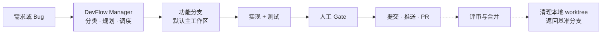

# DevFlow

**版本：1.0.1**

[English](README.md) | 中文

DevFlow 是面向 AI 辅助软件开发的生命周期编排器：把一个需求转化为规划、架构、实现、测试、人工评审和 Pull Request 交付的结构化流程。

它会先识别仓库类型，而不是假设所有项目都是前后端应用；默认在主工作区的功能分支上做当前需求，只有后来者会抢工作区时才建隔离 worktree。



## 为什么使用 DevFlow？

- **自适应流程**——识别仓库类型，只启用相关工作轨道。
- **角色协作**——Manager 在产品、架构、研发和测试 Agent 之间分派工作。
- **安全隔离**——当前需求在主工作区功能分支上做；第二个未完成任务才进 worktree，先到的不搬家。
- **人工决策点**——人审批关键决策，常规工作自动推进。
- **面向交付**——验收后明确执行提交、推送和创建 PR，但不会自动合并。

## 快速开始

### Claude Code 安装

```text
/plugin marketplace add starme/devflow
/plugin install devflow@devflow-marketplace
```

如需固定 marketplace 分支，使用 `starme/devflow#main`，然后重启 Claude Code。

### Codex CLI 安装

```bash
npm install -g @openai/codex
```

```bash
codex plugin marketplace add starme/devflow --ref main
codex plugin add devflow@devflow-marketplace
```

安装后请新建 Codex thread。

### 开始任务

在要开发的项目中执行：

```text
/devflow init
/devflow start "做一个团队周报工具"
```

Bug 或维护类改动使用：

```text
/devflow fix "登录提交后返回 HTTP 500"
```

使用 `/devflow status` 查看进度。自动阶段会干到下一个 Gate，不必打 `/devflow next`。`/devflow next --task <task-id>` 用于会话中断恢复，以及 PR 合并后的清理。

## 它如何工作

1. **分类**——识别仓库类型，选择合适的工作流。
2. **澄清与规划**——必要时由产品和架构阶段产出 PRD、范围和实现方案。
3. **分支与实现**——第一个未完成需求留在主工作区功能分支；会抢工作区的后来者才进 worktree。Agent 遵守明确边界。
4. **测试与修正**——分层运行测试，失败自动回到对应修复环节。
5. **验收**——人工对照已确认的需求验收结果。
6. **交付**——一次确认覆盖白名单提交、分支推送和 PR 创建。

完整状态机和 bugfix/chore 的精简路径见 [docs/workflow.md](docs/workflow.md)。

### 人工决策点

你只需要在五个节点做决策：

1. 需求澄清——明确要做什么。
2. PRD 评审——审批产品需求。
3. 架构评审——审批技术方案和范围。
4. 验收签字——确认结果符合预期。
5. 交付确认——批准 `commit + push + create PR`。

## 验收后会发生什么？

你批准结果后，DevFlow 会一次性展示白名单文件、commit message、推送目标和 PR 预览。直接确认时，默认执行 `commit + push + create PR`；如果提出其他要求，也可以缩小或调整执行范围。

- 只提交代码和明确列入 task 产物清单的文档；运行时上下文、审计日志和临时文件都会排除。
- 交付时，task 产物会归档到 `.devflow/tasks/<task-id>/`（PRD 发布为 `prd-<task-slug>.md`，其余保持固定名），用来追溯方案、完成度、测试和验收。详见[归档决策](docs/adr/0004-task-archive-convergence.md)。
- 创建 PR 后流程暂停，DevFlow 不会自动合并 PR。
- PR 合并后，执行 `/devflow next --task <task-id>`，删除本地 task worktree 和本地分支，保留远程分支，并返回该 task 的基准分支。
- 详细恢复规则见[交付决策](docs/adr/0002-delivery-lifecycle.md)。

## 常用命令

| 命令 | 用途 |
|------|------|
| `/devflow init` | 识别项目并创建项目级配置。 |
| `/devflow start <需求描述>` | 启动完整生命周期的功能 task。 |
| `/devflow fix <描述>` | 启动精简的 Bug 修复或维护 task。 |
| `/devflow status` | 查看项目和 task 状态。 |
| `/devflow next --task <task-id>` | 恢复指定 task 或完成交付清理。 |

## 支持的平台

- **Claude Code**——完整适配，提供 Hard 级别的 PreToolUse 文件安全防护。
- **Codex CLI**——已支持适配，红线能力为 Soft；依赖无人值守执行前请先验证宿主集成。

能力边界和平台细节见[适配器契约](adapters/README.md)。

## 安全摘要

DevFlow 提供三档安全保护：

- **禁止**——禁止读取和写入密钥、凭证等敏感文件。
- **受保护**——允许读取，但修改需要额外保护处理。
- **需审批**——敏感配置、依赖、迁移或认证代码变更需要人工审批。

此外还会执行 task 目录边界、开发期间保护已有测试、危险命令拦截和工具审计。详细说明见项目红线配置和[架构说明](docs/architecture.md)。

## Memorant（可选）

Memorant 提供经验召回、Bug 模式、产品决策和经验蒸馏。未安装 Memorant 时 DevFlow 仍可运行，只是不启用经验召回。

请从 [Memorant 项目](https://github.com/starme/memorant) 单独安装。

## 深入文档

- [完整工作流](docs/workflow.md)
- [架构说明](docs/architecture.md)
- [交付生命周期决策](docs/adr/0002-delivery-lifecycle.md)
- [Task 产物发布决策](docs/adr/0003-task-artifact-publishing.md)
- [适配器契约](adapters/README.md)

## 更新与卸载

使用宿主提供的 marketplace 命令更新并重新安装插件。活动 task 执行期间不要升级，除非已确认版本变更。

Claude Code marketplace 的卸载请通过 Claude Code 的插件管理功能完成。task 的 PR 合并后，使用 `/devflow next --task <task-id>` 清理项目分支和 worktree。
