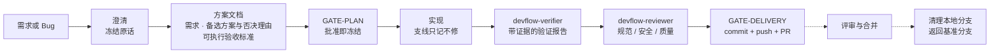

# DevFlow

**版本：2.3.1**

[English](README.md) | 中文

DevFlow 只管模型吸收不了的事：**你的意图**、**可验证的证据**、**独立审查**、**交付授权**。主线程自己干活，不按角色派发 Agent；人只在两个点拍板——方案冻结与交付确认。


```mermaid
flowchart LR
    A["需求或 Bug"] --> Q["澄清<br/>冻结原话"]
    Q --> P["方案文档<br/>需求 · 备选方案与否决理由<br/>可执行验收标准"]
    P --> H1["GATE-PLAN<br/>批准即冻结"]
    H1 --> W["实现<br/>支线只记不修"]
    W --> V["devflow-verifier<br/>带证据的验证报告"]
    V --> R["devflow-reviewer<br/>规范 / 安全 / 质量"]
    R --> H2["GATE-DELIVERY<br/>commit + push + PR"]
    H2 -.-> M["评审与合并"]
    M -.-> C["清理本地分支<br/>返回基准分支"]
```

## 为什么使用 DevFlow？

- **防漂移的需求**——你的原话逐字冻结进方案文档；每条需求标注来源（原话 / 你的回答 / 推断·已确认），审查聚焦展示"超出你原话的部分"。
- **成熟的技术方案**——方案文档必须列出至少两个备选并写明否决理由；说不出否决理由，说明根本没比过。
- **独立验证 + 独立审查**——verifier 逐条跑验收标准（无证据不得 PASS），reviewer 从规范/安全/质量三个维度出带行号的问题清单；两者都不改代码。
- **能自我进化**——经验在**设计时**和**开发时**两处召回：写方案前先问历史怎么做的，开发中遇到报错、失败、首次改文件、加依赖时再问一次。同一个坑不踩两次。
- **交付权在你**——一次确认覆盖白名单提交、推送和创建 PR；PR 永不自动合并。
- **不扩散**——发现方案之外的问题只记录不修，主线完成后统一交给你决定。

## 快速开始

### Claude Code 安装

```text
/plugin marketplace add starme/devflow
/plugin install devflow@devflow-marketplace
```

如需固定 marketplace 分支，使用 `starme/devflow#main`，然后重启 Claude Code。

### Codex CLI 安装

```bash
npm install -g @openai/codex
```

```bash
codex plugin marketplace add starme/devflow --ref main
codex plugin add devflow@devflow-marketplace
```

安装后请新建 Codex thread。

### 开始任务

在要开发的项目中执行：

```text
/devflow init
/devflow start "做一个团队周报工具"
```

Bug 或维护类改动使用：

```text
/devflow fix "登录提交后返回 HTTP 500"
```

使用 `/devflow status` 查看进度。工作会干到下一个 Gate，不必打 `/devflow next`。`/devflow next --task <task-id>` 用于会话中断恢复，以及 PR 合并后的清理。

## 它如何工作

1. **澄清**——原话逐字冻结；一次复述核心诉求获你确认；追问只补核心诉求的缺口（不做加法），模型推断必须显式确认。
2. **设计时召回**——写方案之前先问 Memorant：这类需求上次怎么做的、否掉过什么方案。信任级别（verified / provisional）随结果一起显示。
3. **方案文档**——需求明细（带来源）+ 历史经验 + **备选方案与否决理由（至少两个）** + 验收标准表（`cmd` / `ai` / `manual`，每条映射需求 R#）。GATE-PLAN 批准后冻结为"怎么算做完"。
4. **实现**——主线程直接在工作区做（有未完成 task 时新 task 被拒绝，先完成或归档；多仓库项目创建时只在启动仓建分支，子仓分支延迟到首次改动该仓时才建）。方案之外的问题只记进「待办支线」，不顺手改。开发中遇到报错、verifier FAIL、首次改文件、加依赖时再召回一次。
5. **验证与审查**——`devflow-verifier` 逐条执行验收标准与回归（带证据）；`devflow-reviewer` 从规范 / 安全 / 质量三个维度出带行号的问题清单。两者都不改代码。
6. **交付**——一次确认覆盖白名单提交、推送和创建 PR，验证报告、审查报告、manual 项与待办支线同场展示。

完整状态机和两条路径的差异见 [docs/workflow.md](docs/workflow.md)；决策依据见 [ADR-0005](docs/adr/0005-orchestration-recalibration.md) 与 [ADR-0006](docs/adr/0006-lean-recalibration.md)。

### 人工决策点

你只需要在两个 Gate 做决策：

1. **GATE-PLAN**——审批方案文档：需求、备选方案、验收标准一并冻结。
2. **GATE-DELIVERY**——批准 `commit + push + create PR`，附验证报告、审查报告、人工验收项与待办支线。

外加一个**非 Gate 的决策点**：审查报告出来后，你决定修还是直接交付。

## 交付后会发生什么？

- 只提交代码和明确列入 task 产物清单的文档；运行时上下文、审计日志和临时文件都会排除。
- 交付时，task 产物会归档到 `.devflow/tasks/<task-id>/`（方案文档为 `plan.md`，其余保持固定名），用来追溯方案、验证、审查与交付。详见[归档决策](docs/adr/0004-task-archive-convergence.md)。
- 创建 PR 后流程暂停，DevFlow 不会自动合并 PR。
- PR 合并后，执行 `/devflow next --task <task-id>`，删除本地 task 分支，保留远程分支，并返回该 task 的基准分支。
- 详细恢复规则见[交付决策](docs/adr/0002-delivery-lifecycle.md)。

## 常用命令

| 命令 | 用途 |
|------|------|
| `/devflow init` | 识别项目并创建项目级配置。 |
| `/devflow start <需求描述>` | 启动功能 task：澄清 → 方案文档 → 实现 → 验证 → 审查 → 交付。 |
| `/devflow fix <描述>` | 启动 Bug 修复 task：症状 + 根因并入方案文档（瘦版）→ 修复 → 验证 → 审查 → 交付。 |
| `/devflow status` | 查看项目和 task 状态。 |
| `/devflow next --task <task-id>` | 恢复指定 task 或完成交付清理。 |

不需要显式打命令：描述「分析这个需求开始开发」「把这个 bug 修了」也会被识别，确认后进入流程。

## 支持的平台

- **Claude Code**——完整适配，提供 Hard 级别的 PreToolUse 文件安全防护。
- **Codex CLI**——已支持适配，红线能力为 Soft；依赖无人值守执行前请先验证宿主集成。

能力边界和平台细节见[适配器契约](adapters/README.md)。

## 安全摘要

DevFlow 提供三档安全保护：

- **禁止**——禁止读取和写入密钥、凭证等敏感文件。
- **受保护**——允许读取，但修改需要额外保护处理。
- **需审批**——敏感配置、依赖、迁移或认证代码变更需要人工审批。

此外还会执行 task 目录边界、开发期间保护已有测试、危险命令拦截和工具审计。详细说明见项目红线配置和[架构说明](docs/architecture.md)。

## Memorant（可选）

Memorant 提供经验召回、Bug 模式、产品决策和经验蒸馏。未安装 Memorant 时 DevFlow 仍可运行，只是不启用经验召回。

请从 [Memorant 项目](https://github.com/starme/memorant) 单独安装。

## 深入文档

- [完整工作流](docs/workflow.md)
- [架构说明](docs/architecture.md)
- [减负校准决策（ADR-0006）](docs/adr/0006-lean-recalibration.md)
- [编排层校准决策（ADR-0005）](docs/adr/0005-orchestration-recalibration.md)
- [交付生命周期决策](docs/adr/0002-delivery-lifecycle.md)
- [Task 产物发布决策](docs/adr/0003-task-artifact-publishing.md)
- [适配器契约](adapters/README.md)

## 更新与卸载

使用宿主提供的 marketplace 命令更新并重新安装插件。活动 task 执行期间不要升级，除非已确认版本变更（v2.1 是破坏性升级：阶段值、Agent 与产物路径都有变化，见 ADR-0006）。

Claude Code marketplace 的卸载请通过 Claude Code 的插件管理功能完成。task 的 PR 合并后，使用 `/devflow next --task <task-id>` 清理项目本地分支。
