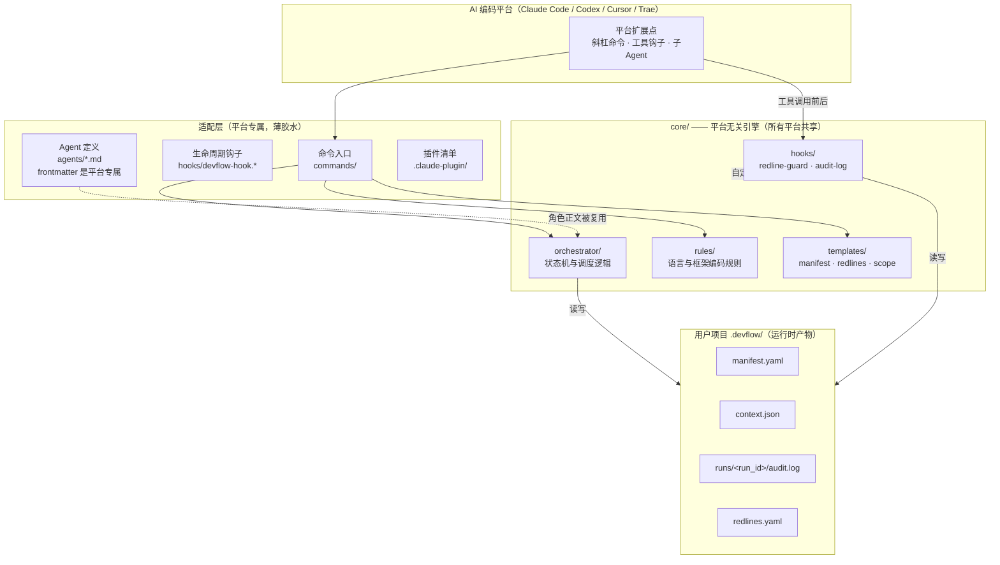

# DevFlow 跨平台架构与适配契约技术设计文档

| 项 | 值 |
|----|----|
| 文档类型 | 技术架构设计（Technical Architecture） |
| 适用版本 | DevFlow 0.2.0 及以后 |
| 受众 | 适配层开发者、平台集成工程师、核心维护者 |
| 状态 | core/ 已落地，Claude Code 适配已交付，其余平台待实现 |

---

## 1. 设计概述

### 1.1 目的

DevFlow 最初作为 Claude Code 插件实现，编排产品、架构、后端、前端、测试五个专职 Agent 完成应用开发全流程。随着目标扩展到 Codex CLI、Cursor、Trae 等平台，原结构把编排逻辑、Hook 脚本、编码规则与 Claude 专属的命令/子 Agent 定义混在同一层，导致任何平台移植都要复制并改写大量代码。

本次设计将平台无关的部分抽离为独立的 `core/` 引擎，把各平台差异收敛到薄适配层。目标是：核心逻辑升级一次，所有平台受益；新增一个平台只需实现一套定义明确的桥接接口，而不是 fork 整份代码库。

### 1.2 范围

本设计覆盖：

- `core/` 与适配层的边界划分
- Hook 脚本的标准输入/输出协议
- 适配层必须提供的能力及 hard/soft 能力分级
- 运行时产物（`.devflow/`）的共享契约
- 新增平台适配的步骤与验收基线

本设计不覆盖：

- 各阶段（PRD、架构、开发、测试、验收）的业务编排逻辑，该逻辑由 [core/orchestrator/SKILL.md](core/orchestrator/SKILL.md) 定义
- Memorant 经验采集的内部实现
- 具体编码规则的内容

### 1.3 设计约束

1. **核心零平台依赖**：`core/` 下的脚本不得 import Claude、Cursor 等任何平台专属模块，仅使用 Python 标准库。
2. **协议即边界**：核心与适配层之间只通过文件系统产物（`.devflow/`）和 stdin/stdout JSON 通信，不共享内存对象。
3. **失败不阻断用户**：所有 Hook 异常时 fail-open（放行并退出 0），绝不因防护脚本自身故障把用户锁在工作流之外。
4. **防护强度如实告知**：不具备前置拦截能力的平台必须降级为 soft 模式，并在初始化时明确告知用户，不得伪装成 hard 模式。

---

## 2. 系统架构

### 2.1 分层结构

DevFlow 在磁盘上分为三个顶层区域：



图中实线是调用或数据流，虚线是定位/引用关系。核心层不反向依赖适配层——它通过 `__file__` 自定位，通过约定的环境变量（如 `CLAUDE_PLUGIN_ROOT`）辅助查找资源。

### 2.2 组件职责

| 组件 | 位置 | 职责 | 平台相关性 |
|------|------|------|-----------|
| 工作流引擎 | [core/orchestrator](core/orchestrator/SKILL.md) | 阶段状态机、流程裁剪、Agent 调度、门禁、失败路由 | 正文无关；`Task` 派发语法需适配层翻译 |
| 红线守护 | [core/hooks/redline-guard.py](core/hooks/redline-guard.py) | 工具执行前的文件/命令拦截 | 无关，纯 CLI |
| 审计日志 | [core/hooks/audit-log.py](core/hooks/audit-log.py) | 工具执行后的操作记录 | 无关，纯 CLI |
| 共享工具 | [core/hooks/devflow_guard_common.py](core/hooks/devflow_guard_common.py) | 项目根定位、redlines 解析、glob、路径判定 | 无关 |
| 编码规则 | [core/rules](core/rules) | 按语言/框架组织的 Markdown 规则 | 无关 |
| 项目模板 | [core/templates](core/templates) | manifest、redlines、scope 等模板 | 无关 |
| 命令入口 | [commands/](commands) | `/devflow init/start/fix/status/next` | Claude 专属格式 |
| 生命周期钩子 | [hooks/devflow-hook.*](hooks) | SessionStart、Stop、PreCompact 等会话事件 | Claude 专属 |
| Agent 定义 | [agents/](agents) | 五个角色的工具权限、边界、frontmatter | frontmatter 专属，正文可复用 |
| 插件清单 | [.claude-plugin/](.claude-plugin) | 注册命令与 Hook | Claude 专属 |

划分的判据很简单：文件内容里出现平台命令名、平台 frontmatter 字段、平台会话事件名的，属于适配层；其余全部进 core。

### 2.3 技术选型依据

Hook 脚本用 Python 3 标准库实现，理由有三点 [专家判断]：

1. Python 3.8+ 在 macOS 上预装，Linux 发行版普遍自带，无需额外安装运行时。
2. 红线判定涉及大量 glob 匹配、路径解析、YAML 的轻量读取，Python 标准库足以覆盖，不引入 pip 依赖。
3. stdin/stdout JSON 协议天然跨平台，任何能执行子进程并管道通信的宿主都能调用。

核心不打包成单二进制（如 PyInstaller），因为脚本需要可读、可审计、可被用户直接修改 redlines 规则，透明性比分发体积更重要 [专家判断]。

---

## 3. 核心模块设计

### 3.1 工作流引擎

[core/orchestrator/SKILL.md](core/orchestrator/SKILL.md) 是一份被主 Agent 读取并遵循的 Markdown 规约，定义了 11 个阶段的状态机：`classify → product_qa → prd_writing → gate_prd → architecture → gate_arch → development → testing → acceptance → distill → done`。

它根据工作类型裁剪流程：feature 走全流程，bugfix 跳过需求与架构评审，chore 进一步精简。架构 Agent 产出的 `scope.yaml` 决定研发阶段调度谁——只涉及后端就只派后端 Agent，前后端契约无变更则两个研发 Agent 并行。

引擎本身不是可执行程序，而是一份行为规约。适配层负责让宿主平台的主 Agent 读取它，并把其中的"派发子 Agent"指令翻译为平台原生机制。这是核心里唯一需要适配层做语义翻译（而非原样透传）的部分。

### 3.2 Hook 脚本

三个 Python 脚本构成 Hook 层，全部位于 [core/hooks/](core/hooks)：

- `redline-guard.py`：PreToolUse 入口，读取 stdin JSON，判定后输出 deny/ask 决策或空输出放行。
- `audit-log.py`：PostToolUse 入口，工具成功后追加一行审计记录。
- `devflow_guard_common.py`：被前两者导入的共享模块，不独立运行。

脚本的核心定位逻辑是 `_find_core_dir()`，它按以下顺序查找 `core/` 目录，确保在任何平台都能找到随包资源：

1. 从 `__file__` 向上一级（`core/hooks/..` = `core/`）查找 `templates/redlines.yaml`。
2. 读取宿主注入的插件根环境变量（当前是 `CLAUDE_PLUGIN_ROOT`），拼接 `/core`。
3. 在 `~/.claude/plugins/cache/*/devflow/*/core` 中回退查找。

新增平台时，如果其插件安装路径不在上述位置，适配层只需设置一个指向 core 父目录的环境变量，或在脚本同级保持 `core/hooks/` 与 `core/templates/` 的兄弟关系即可，无需改脚本。

### 3.3 规则与模板

- [core/rules/engineering.md](core/rules/engineering.md) 是通用工程规则，安装时复制到用户级规则目录。
- 语言与框架规则（go/php/python、vue、go-zero、laravel 等）保留在 core 中，由 Agent 运行时按需读取，不复制到项目，这样插件升级时规则自动更新。
- [core/templates/](core/templates) 在 `/devflow init` 时被复制到项目 `.devflow/`，其中 `redlines.yaml` 用户可自由编辑，立即生效。

---

## 4. 适配层契约

适配层的完整定义维护在 [adapters/README.md](adapters/README.md)，本节是其规范化设计说明。

### 4.1 适配层必须提供的四项能力

| 能力 | 说明 | 核心对应物 |
|------|------|-----------|
| 命令入口 | 把 `devflow init/start/fix/status/next` 注册为平台斜杠命令；init 需定位 core 绝对路径以拷贝模板 | core/templates、core/orchestrator |
| Hook 桥接 | 在写文件/执行命令前后，把平台工具事件组装成统一 JSON 调用 core 脚本 | core/hooks/redline-guard.py、audit-log.py |
| Agent 派发 | 让 Manager 能以独立上下文、受限工具集派发五个角色并收回控制权 | agents/ 正文 + core/orchestrator |
| 运行时上下文维护 | 在阶段切换和派发时更新 `.devflow/context.json` | core 脚本读取该文件 |

四项能力中，Hook 桥接是安全模型的关键，也是平台差异最大的地方。

### 4.2 Hook 标准输入输出协议

适配层在工具执行前后，向 core 脚本的 stdin 写入如下 JSON：

```json
{
  "tool_name": "Write",
  "tool_input": { "file_path": "/path/to/target" },
  "cwd": "/current/working/dir"
}
```

字段约定：

- `tool_name`：`Write`、`Edit`、`MultiEdit`、`Bash` 之一。其余工具名 core 脚本会直接放行。
- `tool_input`：写文件工具含 `file_path`；Bash 含 `command`。字段名沿用 Claude Code 的命名，适配层负责把平台原生字段映射到这套命名。
- `cwd`：工具执行的工作目录，core 据此向上查找 `.devflow/` 以判断 DevFlow 是否激活，并推断当前 Agent 属于哪个 track（后端/前端）。

**redline-guard.py 的 stdout 契约：**

| 结果 | stdout | 退出码 |
|------|--------|--------|
| 放行 | 空 | 0 |
| 拦截 | `{"hookSpecificOutput":{"hookEventName":"PreToolUse","permissionDecision":"deny","permissionDecisionReason":"..."}}` | 0 |
| 需审批 | 同上，`permissionDecision` 为 `"ask"` | 0 |
| 脚本异常 | 空（fail-open） | 0 |

适配层必须把 deny 决策翻译为平台原生的工具拦截行为，把 reason 展示给用户。ask 决策则触发平台的人工确认弹窗。若平台不支持 ask 语义，适配层应将 ask 升级为 deny（安全优先），而不是静默放行。

**audit-log.py 的 stdout 契约：** 无关键输出，退出码始终为 0。它只负责向 `.devflow/runs/<run_id>/audit.log` 追加记录。

### 4.3 能力分级：hard 与 soft

不同平台对"工具执行前拦截"的支持差异，决定了红线防护的实际强度。适配层必须如实声明自己处在哪一档。

| 维度 | hard 模式 | soft 模式 |
|------|-----------|-----------|
| 触发条件 | 平台提供同步 PreToolUse 等价钩子 | 平台无前置钩子 |
| 红线文件 | 写入前硬拦截 | 系统提示声明 + 事后审计 |
| 目录边界 | 越界写入硬拦截 | 提示词约束 + 事后审计 |
| 危险命令 | 执行前硬拦截 | 提示词约束 |
| 审计日志 | 完整 | 完整（事后记录仍可做） |
| 代表平台 | Claude Code | Cursor（待确认） |

适配层在 `/devflow init` 时把档位写入 `.devflow/manifest.yaml` 的 `adapter.capability` 字段。soft 模式下，编排器启动时必须输出明确提示：当前平台不支持前置硬拦截，红线仅为软约束加事后审计。这一约束不可省略——它防止用户在防护降级时仍误以为自己受到硬保护。

Codex CLI 与 Trae 的钩子能力需在实现对应适配前核实官方文档，不能假设其档位。

### 4.4 运行时上下文契约

`.devflow/context.json` 是 core 脚本与编排器之间的运行时纽带，由适配层驱动的主 Agent 维护：

```json
{
  "run_id": "20260818-143022-a1b2c3",
  "current_phase": "development",
  "current_agent": "devflow-backend-dev",
  "cwd": "/path/to/project/server",
  "workspace": {
    "root": "/path/to/project",
    "backend": "server",
    "frontend": "web"
  }
}
```

维护时机在 [core/orchestrator/SKILL.md](core/orchestrator/SKILL.md) 中定义：流程开始生成 `run_id` 并创建文件；每次阶段转换更新 `current_phase`；每次派发 Agent 更新 `current_agent` 与 `cwd`；并行派发时 `current_agent` 设为 `both`、`cwd` 设为项目根。

core 脚本不依赖适配层传参，直接读这个文件，因此适配层只要保证文件被正确写入即可。当 `context.json` 不存在时，core 会降级读取 `manifest.yaml` 中的 workspace 配置，保证即使上下文文件缺失，目录边界判定仍能工作。

---

## 5. 运行时数据模型

### 5.1 .devflow/ 目录结构

所有平台共享同一份磁盘状态，这使得一次开发运行可以跨工具审计、可手工检查、可纳入版本管理：

```
.devflow/
├── manifest.yaml              # 持久状态：阶段、工作类型、workspace、产物索引
├── context.json               # 运行时上下文：run_id、当前阶段/Agent/cwd
├── redlines.yaml              # 项目级红线规则（从 core 模板拷贝，可编辑）
├── rules/                     # 项目自定义规则
│   ├── project.md
│   ├── backend.md
│   └── frontend.md
├── contracts/                 # 阶段间产物契约
└── runs/
    └── <run_id>/
        ├── audit.log          # 审计日志（TSV）
        └── *.md               # 各 Agent 工作报告
```

### 5.2 manifest.yaml

持久状态文件，跨会话保留。记录项目当前阶段、工作类型、workspace 路径、各阶段状态与产物路径。core 的共享模块包含一个极简 YAML 读取器，只提取 workspace 与 phase 字段，避免引入 PyYAML 依赖。

### 5.3 redlines.yaml

三级红线规则。项目级文件优先于 core 内置默认值，因此用户可以在不修改插件的前提下增加保护项，改动立即生效。其结构为三个顶层列表 `forbidden`、`protected`、`approval_required`，以及对应的 `*_negations` 例外列表，支持 glob 模式。

### 5.4 audit.log

每行一条记录，字段以 ` | ` 分隔：

```
2026-08-18T14:50:22 | backend-dev | development | Edit | server/internal/handler.go | Edit
2026-08-18T14:50:25 | backend-dev | development | Bash | bash | go test ./...
```

字段依次为：时间、Agent、阶段、工具、目标、详情。Bash 的详情截断到 200 字符并转义换行与竖线。

---

## 6. 安全设计

### 6.1 三级红线

| 级别 | 行为 | 典型对象 |
|------|------|---------|
| 禁止（forbidden） | 读取和写入均硬拦截 | `.env`、`*.pem`、`*.key`、`secrets.*`、云凭证 |
| 受保护（protected） | 允许读取，修改时硬拦截 | CI/CD 配置、`Dockerfile`、锁文件、`.git/**` |
| 需审批（approval_required） | 修改时询问用户 | `package.json`、`go.mod`、数据库迁移、认证代码 |

除文件规则外，redline-guard 还实施：目录边界（后端 Agent 不能写前端目录，反之亦然）、开发阶段测试文件保护（禁止研发 Agent 修改已有测试使其通过）、危险 Bash 命令拦截（`rm -rf /`、强制推送、`curl | sh` 等）。

### 6.2 fail-open 策略

所有 Hook 脚本的顶层 `main()` 都包裹在 `try/except` 中，任何未预期异常都导致放行并退出 0。这是刻意的安全取舍：防护脚本是质量护栏，不是安全边界本身；如果它因 bug、环境异常或解析失败而阻断用户正常工作，造成的损失大于一次漏判。误拦可以靠审计日志回溯，而锁死工作流会直接让产品不可用。

对应的补偿措施是：审计日志始终尽力写入，且 deny 决策的 reason 会明确标注规则来源，便于事后排查。

### 6.3 软约束与硬约束的分层

DevFlow 不把安全完全押注在 Hook 上，而是三层叠加 [专家判断]：

1. **Agent 提示词**：agents/ 中声明工具权限与目录边界，是第一层引导。
2. **PreToolUse Hook**：在工具执行前硬拦截，是第二层强制。
3. **PostToolUse 审计 + 阶段门禁**：事后记录与校验，是第三层兜底。

在 hard 模式平台三层齐备；在 soft 模式平台第一层和第三层仍在，第二层退化为提示词声明。这一差异必须对用户可见。

---

## 7. 新增平台适配步骤

1. 在 `adapters/<platform>/` 下建立目录。
2. 实现命令入口，使 init 能定位 core 并拷贝模板，start/fix 能驱动主 Agent 读取 [core/orchestrator/SKILL.md](core/orchestrator/SKILL.md)。
3. 实现 Hook 桥接：
   - 平台支持前置拦截时，把工具事件透传给 `core/hooks/redline-guard.py`，并把 stdout 的 deny/ask 翻译为平台原生行为。
   - 不支持时退化为 soft 模式：在系统提示注入红线规则，工具执行后调用 `core/hooks/audit-log.py`。
4. 实现 Agent 派发映射，参考 agents/ 中的角色正文，替换 frontmatter 为平台原生格式。
5. 在 init 流程写入 `adapter.name` 与 `adapter.capability`（hard/soft）。
6. 验收基线：无论哪个平台，同一条命令
   ```bash
   echo '{"tool_name":"Write","tool_input":{"file_path":"<proj>/.env"},"cwd":"<proj>"}' \
     | python3 core/hooks/redline-guard.py
   ```
   必须产出与 Claude 适配一致的 deny 决策。
7. 更新 [adapters/README.md](adapters/README.md) 的适配状态表。

---

## 8. 设计决策记录

### ADR-1：为什么是 core + adapter 而不是每个平台一份 fork

平台专属代码（命令格式、Hook 注册、子 Agent frontmatter）只占整体的一小部分，而编排逻辑、红线规则、审计、编码规则占绝大多数。如果每个平台 fork 一份，同一个 bug 要修四次，规则升级要同步四次。抽离 core 后，平台差异被限制在薄适配层，核心迭代一次全平台受益。代价是引入一层间接和一份适配契约文档，但相比长期维护成本是值得的 [专家判断]。

### ADR-2：为什么 Hook 用 stdin/stdout JSON 而非平台 SDK

平台 SDK 会把 core 绑死在特定平台的语言和版本上。stdin/stdout JSON 是最低公分母：任何能启动子进程的平台都能调用，脚本本身保持平台无关，且可以脱离平台在命令行直接测试。这也是为什么验收基线是一条纯 shell 命令 [专家判断]。

### ADR-3：为什么 soft 模式要显式声明而不是自动降级到提示词

提示词约束与硬拦截有量级差异。如果在不支持前置钩子的平台悄悄退化为提示词约束，用户会基于 Claude Code 上的体验产生错误的安全感。显式写入 capability 并在启动时告知，把真实防护等级交还给用户决策，优于隐瞒降级 [专家判断]。

### ADR-4：为什么现在只解耦不做第二个适配

core 的编排逻辑尚未在真实项目中端到端验证。在抽象未经验证时就铺到多个平台，会把同一个设计缺陷放大数倍。先解耦建立边界，等核心在 Claude Code 上跑通稳定，再用第二个适配检验抽象是否成立，是更低风险的路径 [专家判断]。

---

## 9. 适配状态

| 平台 | 状态 | 能力等级 | 位置 |
|------|------|---------|------|
| Claude Code | 可用 | hard | 插件根目录（`.claude-plugin/`、`commands/`、`hooks/`、`agents/`） |
| Codex CLI | 规划中 | 待核实 | — |
| Cursor | 规划中 | 预估 soft（待核实） | — |
| Trae | 规划中 | 待核实 | — |
