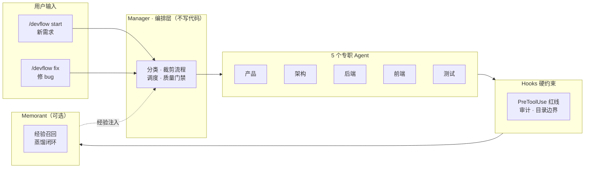

# README 重构技术方案

## 背景

README.md 与 README.zh-CN.md 存在两类问题：

1. **结构问题**：两份 README 各内嵌一份完整 Mermaid 工作流程图（英文 L170-246、中文 L186-259），图与正文混排，不适合对外宣传（PPT、快速浏览）。
2. **内容过时**：通篇只讲旧 `.devflow/manifest.yaml` 单文件状态模型，而代码已迁移到 `project.yaml`（项目长期配置）+ `task.yaml`（每 task 独立 worktree 状态）；多处 Codex 路径与结构树与实际不符。

本方案目标：把详细流程图下沉到 `docs/workflow.md`，README 保留一张精简的宣传型架构图，并同步修正所有过时/不准确表述。

## 一、新的状态模型（README 必须对齐的事实）

代码（`core/orchestrator/`、`core/templates/`、`commands/init.md`、`commands/start.md`）已确立四类状态文件 + legacy 兼容：

| 文件 | 定位 | 作用域 |
|------|------|--------|
| `.devflow/project.yaml` | 项目长期配置 | 分类、capabilities、workspace、adapter、redlines/rules 路径、Memorant key；**不**含当前 phase/描述/分支/PRD |
| `.devflow/task.yaml` | 需求/分支级持久状态 | 每个 task worktree 一份：task id/kind/description、`git.base_ref`/`git.base_commit`、branch/worktree、selected tracks、当前 phase、产物引用 |
| `.devflow/scope.yaml` | 需求架构契约 | 架构 Agent 为当前 task 生成，不复制回其他 task |
| `.devflow/context.json` | 运行时上下文 | 临时文件：task_id/run_id/phase/agent/cwd/worktree/branch/adapter |
| `.devflow/manifest.yaml` | **Legacy**，仅兼容 | 旧项目存在时按单任务流程读取；新任务优先 project.yaml + task worktree |

关键推导（全部来自源码）：
- `/devflow init`（`commands/init.md`）现在生成 `project.yaml` + `.devflow/rules/` + redlines，**不再生成 `CLAUDE.md`**；它会 `mkdir -p docs docs/adr`。
- `/devflow start`（`commands/start.md`）每次创建独立任务：生成 `task_id`、分支 `feature/<slug>-<id>`、仓库外 worktree `../.devflow-worktrees/<repo>/<task-id>/`，写 `.devflow/task.yaml`。
- `core/orchestrator/migration.py` 提供幂等迁移：从旧 manifest 派生 `project.yaml` 与只读 `tasks/legacy/task.yaml`，并在 `.devflow/migration.yaml` 记 marker。旧 manifest **不被删除、不被改写**。
- `core/orchestrator/task_state.py` 定义 `task.yaml` 的 schema 与实际字段。

## 二、README 需调整的结构

### 2.1 迁移详细流程图

- **删除**两份 README 中的完整 Mermaid flowchart（英文 L170-246、中文 L186-259）。
- **新建** `docs/workflow.md`，内容 = 该详细流程图（英文版 + 中文版两份，或一份双语），外加阶段状态机口诀、内外循环边界说明、bugfix/chore 裁剪路径。
- README「Workflow / 工作流程」章节改为：文字简述 + 一张精简宣传图 + 指向 `docs/workflow.md` 的链接。

### 2.2 精简宣传型架构图（留在 README，Mermaid）

替代方案：README 放一张**宣传型架构图**，用 Mermaid 表达 DevFlow 的「定位」，而非逐阶段的流水线细节。设计为一个 flowchart LR（左右展开）更利于 PPT 横屏：

设计原则：
- **不**把逐阶段（CLASSIFY→PRODUCT_QA→…→DONE）细节塞回 README，那些属于 `docs/workflow.md`。
- 只回答「DevFlow 是什么」：输入 → Manager 编排 → 5 专职 Agent → Hooks 硬约束 → Memorant 闭环。
- 保留 classDef 配色（紫=人/Gate、绿=测试、橙=修复），但图本身保持扁平，确保 GitHub/PPT 渲染清晰。

> 注：最终图的渲染细节由研发 Agent 在 README 落地时微调，但**结构必须是扁平宣传型**，禁止把 20+ 节点的详细流程图复制回来。

## 三、README 中需修正的过时/不准确内容清单

### 3.1 状态模型类（高优先级，两份 README 都改）

| # | 位置（英文/中文） | 现状（错误） | 应改为 |
|---|---|---|---|
| 1 | L144 / L154-155 | `/devflow init` 生成 `CLAUDE.md`（英文 step 3 "Generates CLAUDE.md"、中文 step 3） | init 只生成 `project.yaml` + `.devflow/rules/` + redlines，不再生成 CLAUDE.md |
| 2 | L145-146 / L155-156 | init 生成 `manifest.yaml` | init 生成 `.devflow/project.yaml`；task 级状态在 `/devflow start` 时写入 `.devflow/task.yaml` |
| 3 | L114 / L123-125 | 「写入 `.devflow/manifest.yaml`」作为项目状态 | 改为「写入 `.devflow/project.yaml`」；补充 task.yaml 说明 |
| 4 | 通篇 / 通篇 | 无 task worktree 概念 | 新增一句：每个 `/devflow start`/`/devflow fix` 创建独立 git worktree 与 `task.yaml` |
| 5 | L157 / L157 | "No manifest, no phases"（fix 模式描述） | bugfix 仍走 task.yaml + worktree，无 manifest 是无 legacy manifest |
| 6 | L276 / L308 | `.devflow/redlines.yaml`（init 生成） | 保留但建议统一为 `.devflow/redlines.yaml`（实际 `core/templates/redlines.yaml` 仍存在，此项 OK，仅确认命名） |

### 3.2 Codex 路径 / 结构类（高优先级）

| # | 位置 | 现状（错误） | 应改为 |
|---|---|---|---|
| 7 | L283 / L363-367 | `adapters/`「in the future Codex / Cursor / Trae」；中文「Codex/Cursor/Trae 适配待核心验证后再做」 | Codex 适配**已存在**（`adapters/codex/`），删「future」措辞；仍待做的是 Cursor/Trae |
| 8 | L81 / L90 | manifest 路径 `plugins/devflow/.codex-plugin/plugin.json`、marketplace `.agents/plugins/marketplace.json` | 路径**正确**（已核实存在），但「What's Bundled」结构树漏列 `plugins/`、`.agents/`，需补 |
| 9 | L290-330 / L372-412 | 结构树过时：`core/templates/` 仅列 `manifest.yaml/scope.yaml/redlines.yaml/rules-{...}.md`；漏 `plugins/`、`.agents/`、`core/project_analyzer.py` | 补全 `project.yaml`/`task.yaml`/`context.json`（templates）、`project_analyzer.py`、`orchestrator/{migration,task_state,worktree_manager,worktree_sync}.py`、`core/tests/`、`plugins/`、`.agents/`、`adapters/codex/` |
| 10 | L283 / 367 | 英文结构树的 rules 文件名写 `rules-{project,backend,frontend}.md`（占位符） | 实际是 `rules-project.md`/`rules-backend.md`/`rules-frontend.md` |

### 3.3 分类 / 轨道类（中优先级）

| # | 位置 | 现状（错误/不全） | 应改为 |
|---|---|---|---|
| 11 | L114 / L123 | 类别列表缺 `ai_tool_or_workflow`、`library_or_other` | 补全 7 类：`traditional_application`、`ai_agent_application`、`agent_plugin`、`skill`、`mcp_server`、`ai_tool_or_workflow`、`library_or_other` |
| 12 | L116 / L125 | 轨道列表「plugin, command, skill, agent, hook, MCP/tool, evaluation, packaging, documentation」 | 补充内建轨道 `product`/`architecture`/`distill`（`core/project_analyzer.py` 的 `TRACKS_BY_CATEGORY`），并说明 backend/frontend 只是可选轨道 |
| 13 | L318 / L398 | 中文「5 个专职 Agent」表模型列「sonnet」 | 保留（已核实 `agents/*.md` 均为 `model: sonnet`），但补充 subagent name（`devflow-product` 等）一致性 |

### 3.4 措辞 / 一致性（低优先级）

| # | 位置 | 现状 | 建议 |
|---|---|---|---|
| 14 | L258 / L272 | 「Stop hook 向 Manager 请求 continue」表述 | 表述可用，随 workflow 图下沉到 docs/workflow.md |
| 15 | L311 / L407 | 结构树 `README.md` 注释「English documentation」 | 应含 README.zh-CN.md（英文版树漏列中文 README） |

## 四、文件边界

- **只允许修改**：`README.md`、`README.zh-CN.md`、`docs/`（新建 `docs/workflow.md` 及必要的 `docs/adr/0001-*.md`）。
- **禁止修改**：`core/`、`commands/`、`agents/`、`hooks/`、`adapters/`、`plugins/`、`.agents/`、`.claude-plugin/`、`install.sh` 下的一切（它们是 README 的事实来源，只读参照）。
- **附带发现（不修）**：`install.sh` L82-83 的收尾 echo 中 templates 描述仍是旧的 "(manifest, redlines, scope)"，漏 project.yaml/task.yaml/context.json —— 属源码，超出本任务边界，仅提示 Manager 后续可另开 chore。

## 五、风险

- **图下沉导致信息丢失**：详细流程图移走后，README 需保证「人类 4 个决策点」「三级红线」「目录边界」等关键信息仍在 README 正文保留（它们本就是独立章节，不受影响）。
- **中英文同步**：两份 README + workflow.md 需保持术语一致，避免只改英文漏中文。
- **渲染兼容**：精简图尽量用 Mermaid 基础语法，避免依赖过新特性导致 GitHub/部分 PPT 渲染失败。

## 六、验证要点

- Mermaid 图语法可通过 GitHub 渲染 + 本地 `mermaid-cli`（若可用）校验。
- 文中所有路径（`plugins/devflow/.codex-plugin/plugin.json`、`.agents/plugins/marketplace.json`、`adapters/codex/` 等）需反查实际文件存在。
- 状态模型描述需与 `core/templates/project.yaml`、`task.yaml`、`migration.py` 一致。
