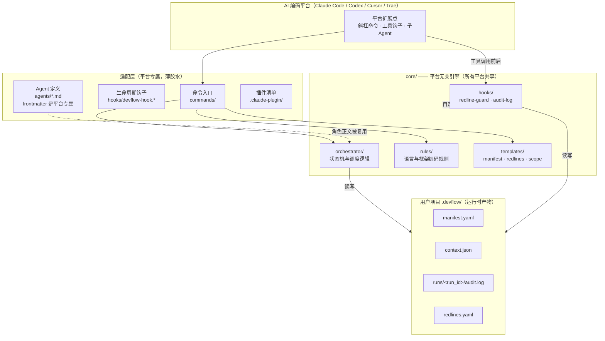

# DevFlow 跨平台架构交付报告

| 项 | 值 |
|----|----|
| 交付物 | DevFlow 平台无关核心（core/）+ Claude Code 适配层 + 适配契约 |
| 版本 | 0.2.0 |
| 交付日期 | 2026-08-18 |
| 文档性质 | 交付报告（架构设计 + 适配契约 + 适配状态 + 验证结果） |
| 受众 | 项目负责人、平台集成工程师、核心维护者 |

---

## 1. 交付背景

DevFlow 最初作为 Claude Code 插件实现，编排产品、架构、后端、前端、测试五个专职 Agent，覆盖从需求到验收的应用开发全流程。随着目标扩展到 Codex CLI、Cursor、Trae 等平台，原始结构把编排逻辑、Hook 脚本、编码规则与 Claude 专属的命令、子 Agent 定义混在同一层，任何平台移植都要复制并改写大量代码。

本次交付的核心目标是：把平台无关的部分抽离为独立的 `core/` 引擎，把各平台差异收敛到薄适配层。核心逻辑升级一次，所有平台受益；新增一个平台只需实现一套定义明确的桥接接口，而不是 fork 整份代码库。

### 1.1 交付范围

本次交付包含：

- `core/` 平台无关引擎的完整落地（工作流引擎、Hook 脚本、编码规则、项目模板）
- Claude Code 适配层的路径重构与验证
- 适配层契约文档与 hard/soft 能力分级定义
- 中英文 README 架构章节更新
- 端到端验证（红线拦截、审计日志、真实安装路径）

本次不包含：

- Codex CLI / Cursor / Trae 的实际适配实现（仅定义契约与状态）
- 工作流引擎业务逻辑的改动
- Memorant 集成方式的变更

---

## 2. 交付物清单

| 交付物 | 位置 | 说明 |
|--------|------|------|
| 平台无关核心 | [core/](core) | 工作流引擎、Hook、规则、模板，零平台专属依赖 |
| 红线守护脚本 | [core/hooks/redline-guard.py](core/hooks/redline-guard.py) | PreToolUse 硬拦截，纯 Python 标准库 |
| 审计日志脚本 | [core/hooks/audit-log.py](core/hooks/audit-log.py) | PostToolUse 操作记录 |
| 共享工具模块 | [core/hooks/devflow_guard_common.py](core/hooks/devflow_guard_common.py) | 项目根定位、redlines 解析、路径判定 |
| 自动化测试 | [core/tests/test_redline_guard.py](core/tests/test_redline_guard.py) | 越界写入 + 红线拦截的 stdin/stdout 契约测试（纯标准库） |
| 工作流引擎 | [core/orchestrator/SKILL.md](core/orchestrator/SKILL.md) | 11 阶段状态机与调度逻辑 |
| 编码规则 | [core/rules/](core/rules) | go/php/python/vue 等语言框架规则 |
| 项目模板 | [core/templates/](core/templates) | manifest、redlines、scope 模板 |
| Claude 适配层 | 插件根目录（`.claude-plugin/`、[commands/](commands)、[hooks/](hooks)、[agents/](agents)） | 桥接 Claude 扩展点到 core |
| 适配契约 | [adapters/README.md](adapters/README.md) | 适配层实现规范与能力分级 |
| 安装脚本 | [install.sh](install.sh) | 权限设置、全局规则安装 |
| 中英文档 | [README.md](README.md)、[README.zh-CN.md](README.zh-CN.md) | 用户文档 |

---

## 3. 跨平台架构设计

### 3.1 分层结构

DevFlow 在磁盘上分为三个顶层区域：平台无关核心 `core/`、平台专属适配层、用户项目内的运行时产物 `.devflow/`。



图中实线是调用或数据流，虚线是定位/引用关系。核心层不反向依赖适配层——它通过 `__file__` 自定位，通过约定的环境变量辅助查找资源。

### 3.2 组件职责与边界

划分判据：文件内容里出现平台命令名、平台 frontmatter 字段、平台会话事件名的，属于适配层；其余全部进 core。

| 组件 | 职责 | 平台相关性 |
|------|------|-----------|
| [core/orchestrator](core/orchestrator/SKILL.md) | 阶段状态机、流程裁剪、Agent 调度、门禁、失败路由 | 正文无关；`Task` 派发语法需适配层翻译 |
| [core/hooks/redline-guard.py](core/hooks/redline-guard.py) | 工具执行前的文件/命令拦截 | 无关，纯 CLI |
| [core/hooks/audit-log.py](core/hooks/audit-log.py) | 工具执行后的操作记录 | 无关，纯 CLI |
| [core/hooks/devflow_guard_common.py](core/hooks/devflow_guard_common.py) | 项目根定位、redlines 解析、glob、路径判定 | 无关 |
| [core/rules](core/rules) | 按语言/框架组织的编码规则 | 无关 |
| [core/templates](core/templates) | manifest、redlines、scope 等模板 | 无关 |
| [commands/](commands) | `/devflow init/start/fix/status/next` | Claude 专属格式 |
| [hooks/devflow-hook.*](hooks) | SessionStart、Stop、PreCompact 会话事件 | Claude 专属 |
| [agents/](agents) | 五个角色的工具权限、边界、frontmatter | frontmatter 专属，正文可复用 |
| [.claude-plugin/](.claude-plugin) | 注册命令与 Hook | Claude 专属 |

### 3.3 核心自定位机制

Hook 脚本的核心定位逻辑是 `_find_core_dir()`，按以下顺序查找 `core/` 目录，确保在任何平台都能找到随包资源：

1. 从 `__file__` 向上一级（`core/hooks/..` = `core/`）查找 `templates/redlines.yaml`。
2. 读取宿主注入的插件根环境变量（当前是 `CLAUDE_PLUGIN_ROOT`），拼接 `/core`。
3. 在 `~/.claude/plugins/cache/*/devflow/*/core` 中回退查找。

新增平台时，如果其插件安装路径不在上述位置，适配层只需设置一个指向 core 父目录的环境变量，或在脚本同级保持 `core/hooks/` 与 `core/templates/` 的兄弟关系即可，无需改脚本。

### 3.4 技术选型依据

Hook 脚本用 Python 3 标准库实现：

- Python 3.8+ 在 macOS 上预装，Linux 发行版普遍自带，无需额外运行时。
- 红线判定涉及 glob 匹配、路径解析、YAML 轻量读取，标准库足以覆盖，不引入 pip 依赖。
- stdin/stdout JSON 协议天然跨平台，任何能启动子进程并管道通信的宿主都能调用。

核心不打包成单二进制，因为脚本需要可读、可审计、可被用户直接修改 redlines 规则，透明性比分发体积更重要。

---

## 4. 适配层契约

### 4.1 core/ 提供的资源

适配层不需要重写以下内容，直接消费即可：

| 资源 | 路径 | 消费方式 |
|------|------|---------|
| 工作流引擎 | `core/orchestrator/SKILL.md` | 适配层让主 Agent 读取并遵循；`Task` 派发语法移植时翻译为目标平台等价机制 |
| 红线守护 | `core/hooks/redline-guard.py` | 从 stdin 读 JSON，向 stdout 输出拦截决策 |
| 审计日志 | `core/hooks/audit-log.py` | 把操作追加到 `.devflow/runs/<run_id>/audit.log` |
| 共享模块 | `core/hooks/devflow_guard_common.py` | 定位 core、解析 manifest/redlines |
| 编码规则 | `core/rules/` | 语言/框架规则（Markdown），运行时加载 |
| 项目模板 | `core/templates/` | init 时拷贝到项目 |
| Agent 角色定义 | `agents/*.md` | 角色正文平台无关，仅 frontmatter 专属 |

### 4.2 适配层必须提供的四项能力

| 能力 | 说明 |
|------|------|
| 命令入口 | 把 `devflow init/start/fix/status/next` 注册为平台斜杠命令；init 需定位 core 绝对路径以拷贝模板 |
| Hook 桥接 | 在写文件/执行命令前后，把平台工具事件组装成统一 JSON 调用 core 脚本 |
| Agent 派发 | 让 Manager 能以独立上下文、受限工具集派发五个角色并收回控制权 |
| 运行时上下文维护 | 在阶段切换和派发时更新 `.devflow/context.json` |

命令映射：

| 命令 | 行为 |
|------|------|
| `devflow init` | 探测技术栈、拷贝模板、生成 manifest/redlines |
| `devflow start <需求>` | 走完整 feature 流程 |
| `devflow fix <bug>` | 走精简 bugfix 流程 |
| `devflow status` | 读取 manifest，报告当前阶段/产物/下一步 |
| `devflow next` | 从中断处继续 |

### 4.3 Hook 标准输入输出协议

适配层在工具执行前后，向 core 脚本 stdin 写入：

```json
{
  "tool_name": "Write",
  "tool_input": { "file_path": "/path/to/target" },
  "cwd": "/current/working/dir"
}
```

字段约定：

- `tool_name`：`Write`、`Edit`、`MultiEdit`、`Bash` 之一，其余工具名 core 直接放行。
- `tool_input`：写文件工具含 `file_path`；Bash 含 `command`。适配层负责把平台原生字段映射到这套命名。
- `cwd`：工具执行工作目录，core 据此向上查找 `.devflow/` 判断是否激活，并推断 Agent 所属 track。

**redline-guard.py 输出契约：**

| 结果 | stdout | 退出码 |
|------|--------|--------|
| 放行 | 空 | 0 |
| 拦截 | `{"hookSpecificOutput":{"hookEventName":"PreToolUse","permissionDecision":"deny","permissionDecisionReason":"..."}}` | 0 |
| 需审批 | 同上，`permissionDecision` 为 `"ask"` | 0 |
| 脚本异常 | 空（fail-open） | 0 |

适配层必须把 deny 翻译为平台原生拦截行为并展示 reason；把 ask 翻译为人工确认。若平台不支持 ask 语义，应升级为 deny（安全优先），不得静默放行。

**audit-log.py 输出契约：** 无关键输出，退出码始终为 0，只负责追加审计记录。

### 4.4 能力分级：hard 与 soft

不同平台对"工具执行前拦截"的支持差异，决定红线防护的实际强度。适配层必须如实声明档位。

| 能力 | hard 模式 | soft 模式 |
|------|-----------|-----------|
| 触发条件 | 平台支持同步 PreToolUse 等价钩子 | 平台无前置钩子 |
| 红线文件 | 写入前硬拦截 | 系统提示声明 + 事后审计 |
| 目录边界 | 越界写入硬拦截 | 提示词约束 + 事后审计 |
| 危险命令 | 执行前硬拦截 | 提示词约束 |
| 审计日志 | 完整 | 完整（事后记录仍可做） |
| 代表平台 | Claude Code | Cursor（待确认） |

规则：

- 适配层在 `devflow init` 时必须探测平台能力，写入 `.devflow/manifest.yaml` 的 `adapter.capability: hard | soft`。
- soft 模式下，编排器启动时必须明确告知用户：当前平台不支持前置硬拦截，红线仅为软约束加事后审计。
- soft 模式不得伪装成 hard 模式。宁可让用户知道防护降级，也不给出虚假安全感。
- Codex CLI / Trae 是否支持前置钩子，需逐家核实官方文档，不能假设。

### 4.5 运行时上下文契约

`.devflow/context.json` 是 core 脚本与编排器之间的运行时纽带：

```json
{
  "run_id": "20260818-143022-a1b2c3",
  "current_phase": "development",
  "current_agent": "devflow-backend-dev",
  "cwd": "/path/to/project/server",
  "workspace": {
    "root": "/path/to/project",
    "backend": "server",
    "frontend": "web"
  }
}
```

维护时机：流程开始生成 `run_id` 并创建文件；每次阶段转换更新 `current_phase`；每次派发 Agent 更新 `current_agent` 与 `cwd`；并行派发时 `current_agent` 设为 `both`、`cwd` 设为项目根。

core 脚本不依赖适配层传参，直接读这个文件。当 `context.json` 不存在时，core 降级读取 `manifest.yaml` 中的 workspace 配置，保证目录边界判定仍能工作。

---

## 5. 运行时数据模型

所有平台共享同一份磁盘状态，使一次开发运行可跨工具审计、可手工检查、可纳入版本管理：

```
.devflow/
├── manifest.yaml              # 持久状态：阶段、工作类型、workspace、产物索引
├── context.json               # 运行时上下文：run_id、当前阶段/Agent/cwd
├── redlines.yaml              # 项目级红线规则（从 core 模板拷贝，可编辑）
├── rules/                     # 项目自定义规则
│   ├── project.md
│   ├── backend.md
│   └── frontend.md
├── contracts/                 # 阶段间产物契约
└── runs/
    └── <run_id>/
        ├── audit.log          # 审计日志（TSV）
        └── *.md               # 各 Agent 工作报告
```

**audit.log 格式**，每行一条记录，字段以 ` | ` 分隔：

```
2026-08-18T14:50:22 | backend-dev | development | Edit | server/internal/handler.go | Edit
2026-08-18T14:50:25 | backend-dev | development | Bash | bash | go test ./...
```

字段依次为：时间、Agent、阶段、工具、目标、详情。Bash 详情截断到 200 字符并转义换行与竖线。

**redlines.yaml** 为三级规则：`forbidden`（禁止读写）、`protected`（禁止修改）、`approval_required`（修改需人工批准），以及对应的 `*_negations` 例外列表，支持 glob 模式。项目级文件优先于 core 内置默认值，用户编辑立即生效。

---

## 6. 安全设计

### 6.1 三级红线

| 级别 | 行为 | 典型对象 |
|------|------|---------|
| 禁止（forbidden） | 读取和写入均硬拦截 | `.env`、`*.pem`、`*.key`、`secrets.*`、云凭证 |
| 受保护（protected） | 允许读取，修改时硬拦截 | CI/CD 配置、`Dockerfile`、锁文件、`.git/**` |
| 需审批（approval_required） | 修改时询问用户 | `package.json`、`go.mod`、数据库迁移、认证代码 |

除文件规则外，redline-guard 还实施：目录边界（后端 Agent 不能写前端目录，反之亦然）、开发阶段测试文件保护（禁止研发 Agent 修改已有测试使其通过）、危险 Bash 命令拦截（`rm -rf /`、强制推送、`curl | sh` 等）。

### 6.2 fail-open 策略

所有 Hook 脚本的顶层 `main()` 都包裹在 `try/except` 中，任何未预期异常都导致放行并退出 0。这是刻意的取舍：防护脚本是质量护栏，不是安全边界本身；如果它因 bug 或环境异常阻断用户正常工作，损失大于一次漏判。误拦可靠审计日志回溯，而锁死工作流会直接让产品不可用。

补偿措施：审计日志始终尽力写入，deny 决策的 reason 明确标注规则来源，便于事后排查。

### 6.3 三层防护叠加

DevFlow 不把安全完全押注在 Hook 上：

1. **Agent 提示词**：agents/ 中声明工具权限与目录边界，是第一层引导。
2. **PreToolUse Hook**：工具执行前硬拦截，是第二层强制。
3. **PostToolUse 审计 + 阶段门禁**：事后记录与校验，是第三层兜底。

hard 模式平台三层齐备；soft 模式平台第一层和第三层仍在，第二层退化为提示词声明。这一差异必须对用户可见。

---

## 7. 适配状态

### 7.1 平台适配状态表

| 平台 | 状态 | 能力等级 | 位置 | 备注 |
|------|------|---------|------|------|
| Claude Code | 可用 | hard | 插件根目录（`.claude-plugin/`、`commands/`、`hooks/`、`agents/`） | 已通过端到端验证 |
| Codex CLI | 规划 | 待核实 | — | 需调研子 agent/role 配置机制与前置钩子能力 |
| Cursor | 规划 | 预估 soft（待核实） | — | 可能对应 background agent / custom command |
| Trae | 规划 | 待核实 | — | 需调研 Skill/agent 机制 |

### 7.2 各平台待核实事项

| 平台 | 命令入口 | 前置钩子 | 子 Agent 派发 | 上下文注入 |
|------|---------|---------|--------------|-----------|
| Codex CLI | 斜杠命令/指令机制是否可注册 | 是否支持工具执行前同步拦截 | 子 agent / role 配置形态 | 是否能在会话中写文件并被读取 |
| Cursor | custom command 能力 | 是否提供 PreToolUse 等价钩子（预估无） | background agent 能力 | 同上 |
| Trae | Skill / 命令注册 | 前置钩子能力待查 | Skill/agent 机制 | 同上 |

> 第二个适配应在核心逻辑于真实项目中端到端验证后再做，避免把同一个缺陷复制到多个平台。实现前必须逐家核实官方文档，确认实际能力等级后再动手，不能基于预估推进。

---

## 8. 验证结果

以下验证均在源码目录（`devflow/`，代码版本 0.2.0）下执行。Hook 脚本不依赖安装路径，自动化测试用临时项目夹具直接驱动 `redline-guard.py` 的 stdin/stdout 契约。

> 注：早期曾在 `~/.claude/plugins/cache/.../devflow/0.1.0/` 目录名下手工做过路径验证，但该目录名是历史遗留，与 `plugin.json` 声明的 0.2.0 不一致（cache 目录名由 Claude Code 的 marketplace 缓存管理，与插件自身版本解耦）。本报告以当前 0.2.0 源码 + 自动化测试为准，不再把 cache 目录名作为版本证据。

### 8.1 Hook 自动化测试（越界写入 + 红线）

测试脚本 [core/tests/test_redline_guard.py](../core/tests/test_redline_guard.py)，运行：

```bash
python3 -m unittest core.tests.test_redline_guard core.tests.test_devflow_hook
```

当前测试覆盖红线、Worktree 和 Stop Hook 自动续跑场景。

| 场景 | 预期 | 结果 |
|------|------|------|
| backend Agent 写 backend 目录 | allow | 通过 |
| backend Agent 写 frontend 目录 | deny | 通过 |
| frontend Agent 写 backend 目录 | deny | 通过 |
| 研发 Agent 写契约文件（`.devflow/contracts/`） | deny | 通过 |
| 写 forbidden 文件（`.env`） | deny | 通过 |
| 写普通代码文件 | allow | 通过 |
| hook cwd 覆盖 stale context.json cwd | allow | 通过（回归 cwd 优先级修复） |

### 8.2 静态检查

| 项 | 结果 |
|----|------|
| Hook 脚本语法（`python3 -m py_compile`） | 通过 |
| 契约路径一致性（全局搜索 `docs/api`） | 无残留，统一为 `.devflow/contracts/` |
| 旧路径引用（`hooks/redline-guard.py` 等） | 无残留，全部指向 `core/` |
| adapter 段落（manifest 模板） | 已补充 `adapter.name` / `adapter.capability` |

### 8.3 已知未验证项

- **fail-open 运行测试**：fail-open 行为目前仅通过代码审查确认（所有顶层异常被捕获并放行），尚未用 malformed JSON、损坏 manifest、损坏 redlines、缺失 context.json 等故障输入做运行级验证。
- **软约束端到端**：soft 模式启动告警依赖 `adapter.capability` 落地（本报告已补齐 manifest 字段与 init 写入逻辑），但尚未在真实 soft 平台上端到端验证。
- **真实项目闭环**：尚无真实 feature/bugfix 从 init 到 done 的端到端记录，属于后续工作。

---

## 9. 新增平台适配步骤

1. 在 `adapters/<platform>/` 下建立目录。
2. 实现命令入口，使 init 能定位 core 并拷贝模板，start/fix 能驱动主 Agent 读取 `core/orchestrator/SKILL.md`。
3. 实现 Hook 桥接：
   - 平台支持前置拦截时，把工具事件透传给 `core/hooks/redline-guard.py`，把 stdout 的 deny/ask 翻译为平台原生行为。
   - 不支持时退化为 soft 模式：在系统提示注入红线规则，工具执行后调用 `core/hooks/audit-log.py`。
4. 实现 Agent 派发映射，参考 `agents/` 角色正文，替换 frontmatter 为平台原生格式。
5. 在 init 流程写入 `adapter.name` 与 `adapter.capability`（hard/soft）。
6. 验收基线：无论哪个平台，以下命令必须产出与 Claude 适配一致的 deny 决策：
   ```bash
   echo '{"tool_name":"Write","tool_input":{"file_path":"<proj>/.env"},"cwd":"<proj>"}' \
     | python3 core/hooks/redline-guard.py
   ```
7. 更新 [adapters/README.md](adapters/README.md) 与本报告第 7 节的适配状态表。

---

## 10. 设计决策记录

**ADR-1：为什么是 core + adapter 而不是每个平台一份 fork**
平台专属代码只占整体一小部分，编排逻辑、红线规则、审计、编码规则占绝大多数。fork 会让同一个 bug 修四次、规则升级同步四次。抽离 core 后差异限制在薄适配层，代价是引入一层间接和一份契约文档，相比长期维护成本值得。

**ADR-2：为什么 Hook 用 stdin/stdout JSON 而非平台 SDK**
平台 SDK 会把 core 绑死在特定平台的语言和版本上。stdin/stdout JSON 是最低公分母：任何能启动子进程的平台都能调用，脚本保持平台无关，且可脱离平台在命令行直接测试。这也是验收基线是一条纯 shell 命令的原因。

**ADR-3：为什么 soft 模式要显式声明而不是自动降级**
提示词约束与硬拦截有量级差异。在不支持前置钩子的平台悄悄退化为提示词约束，用户会基于 Claude Code 上的体验产生错误安全感。显式写入 capability 并在启动时告知，把真实防护等级交还给用户决策。

**ADR-4：为什么现在只解耦不做第二个适配**
core 的编排逻辑尚未在真实项目中端到端验证。在抽象未经验证时铺到多个平台，会把同一个设计缺陷放大数倍。先解耦建立边界，等核心在 Claude Code 上跑通稳定，再用第二个适配检验抽象是否成立。

---

## 11. 后续路线

| 阶段 | 内容 | 前置条件 |
|------|------|---------|
| 当前 | core 解耦 + Claude Code 适配交付 | 已完成 |
| 下一步 | 核心工作流在真实项目中端到端验证 | 选取一个真实 feature/bugfix 完整跑通 |
| 第二步 | 实现第二个平台适配（建议 Codex CLI 或 Trae） | 核心验证通过；完成目标平台官方能力调研 |
| 第三步 | 用第二个适配检验抽象，修订适配契约 | 第二个适配跑通 |
| 后续 | 扩展到 Cursor 等其余平台 | 契约稳定后批量推进 |

当前交付物已可在 Claude Code 上正常使用，对现有功能无破坏。重启 Claude Code 后适配层照常工作。
