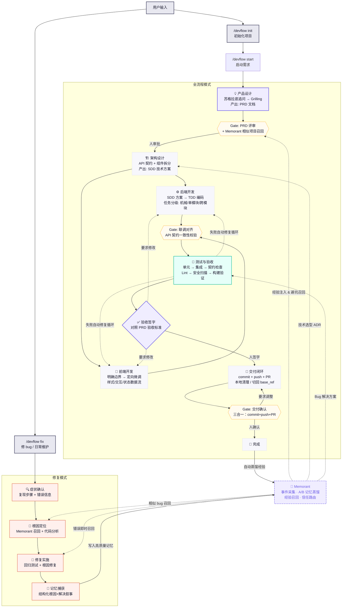

# DevFlow 工作流程详解

> 本文件承接 README 中下沉的完整 Mermaid 工作流程图，并补充阶段状态机、内外循环边界与 bugfix/chore 裁剪说明，供需要了解逐阶段细节的读者参考。README 只保留一张扁平宣传型架构图。

## 完整工作流程图



**图例：** 紫色边框 = 需要人决策 ｜ 黄色虚线框 = 质量门禁 ｜ 绿色 = 测试阶段 ｜ 橙色 = 修复模式 ｜ 紫色虚线 = Memorant 学习闭环

## 阶段状态机

DevFlow 的完整阶段序列如下（源自 `core/orchestrator/SKILL.md`）：

```text
IDLE → CLASSIFY → PRODUCT_QA → PRD_WRITING → GATE_PRD → ARCHITECTURE
      → GATE_ARCH → DEVELOPMENT → TESTING → ACCEPTANCE → DELIVERY → GATE_DELIVERY → DISTILL → DONE
```

- **外层循环（需求确认）**：`IDLE → CLASSIFY → PRODUCT_QA → PRD_WRITING → GATE_PRD → ARCHITECTURE → GATE_ARCH`。这一层每一步都可能暂停，等待人类输入（分类确认、需求澄清、PRD 审批、架构审批）。
- **内层循环（实现流水线）**：`DEVELOPMENT ↔ TESTING`。任务由研发 Agent 按 scope 实现（可并行），每个 task 自带 VALIDATE 门控自检；测试 Agent 做全量回归。
- **收尾**：`ACCEPTANCE → DELIVERY → GATE_DELIVERY → DISTILL → DONE`。产品 Agent 对照 PRD 验收；签字后进入交付闭环（提交 commit + 推送分支 + 创建 PR，PR 创建后暂停不自动合并），随后蒸馏经验到 Memorant（或写 `docs/retrospective.md`）。

- **产物发布（publish）**：`DELIVERY` 阶段在提交/推送之外，还需把 task 产物正式发布到主工作区的 `docs/tasks/<task-id>/` 命名空间（收集白名单内的 PRD、架构、scope、测试与验收产物，PRD 发布为 `prd-<task-slug>.md`，其余保持固定名）。发布是幂等操作，目标内容未变则跳过；内容不同则拒绝覆盖并报告冲突。发布完成的产物与 task.yaml 中的 `artifacts` 引用形成「worktree 临时路径 + 已发布路径」双路径对照。

## 内外循环边界

- **内层自动流转**：`DEVELOPMENT ↔ TESTING` 之间的失败只在内部绕，不打扰用户。每个 task 的 VALIDATE 是第一道门控，测试 Agent 的全量回归是第二道门控。
- **突破到外层**只发生在三种情况：测试 3 轮仍失败、发现需求矛盾或 PRD 问题、用户在 Gate 要求修改方案。此时停止自动流程，报告用户决策。
- **方案冻结**：`GATE_ARCH` 通过即"方案冻结"，scope.yaml 中的任务、契约、文件范围是内层循环的执行依据；研发 Agent 的任何偏差都必须在实现报告中记录。

## bugfix / chore 裁剪路径

bugfix 与 chore 跳过重环节，只保留根因诊断与实现闭环：

| 工作类型 | 保留的阶段 | 跳过的阶段 |
|---------|-----------|-----------|
| **feature**（新功能） | CLASSIFY → PRODUCT_QA → PRD_WRITING → GATE_PRD → ARCHITECTURE → GATE_ARCH → DEVELOPMENT → TESTING → ACCEPTANCE → DELIVERY → GATE_DELIVERY → DISTILL → DONE | 无 |
| **bugfix**（修 bug） | CLASSIFY → ARCHITECTURE（根因分析）→ DEVELOPMENT → TESTING → DELIVERY → GATE_DELIVERY → DISTILL | PRODUCT_QA、PRD_WRITING、GATE_PRD、GATE_ARCH、ACCEPTANCE |
| **chore**（杂项） | CLASSIFY → ARCHITECTURE（影响分析）→ DEVELOPMENT → TESTING → DELIVERY → GATE_DELIVERY → DISTILL | PRODUCT_QA、PRD_WRITING、GATE_PRD、GATE_ARCH、ACCEPTANCE |

- **bugfix** 从 CLASSIFY 直接进入 ARCHITECTURE，架构 Agent 以 `diagnosis` 模式做根因分析而不是完整技术方案。
- **ACCEPTANCE（验收）** 被替换为回归确认：Manager 检查测试报告中的相关测试是否全部通过，向用户报告"修复已通过回归测试"即可。
- **DELIVERY（交付）** 是三种 work_type 都走的闭环：feature 在验收签字后、bugfix/chore 在回归确认通过后，走 commit + push + PR，PR 创建后暂停不自动合并。

## 人类介入点

全流程中人类只需在 5 个点介入（其余自动执行）：

1. **需求澄清（Q&A）** —— 苏格拉底式追问，明确要做什么
2. **PRD 评审** —— 审批产品需求文档
3. **架构评审** —— 审批技术方案和范围
4. **验收签字** —— 最终确认
5. **交付确认（三合一：commit + push + PR）** —— 验收签字后一次确认提交、推送、创建 PR（PR 创建后暂停不自动合并）

自动阶段结束时，Stop Hook 会尝试阻止会话结束并提示 Manager 继续；如果宿主仍结束会话，运行 `/devflow next` 恢复。Gate 阶段始终等待人工审批。
